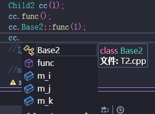
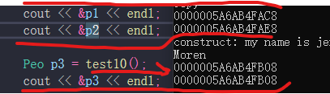
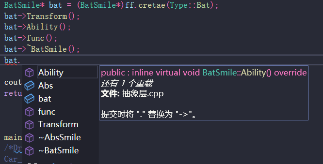
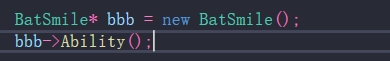

# virtual 
被 virtual 关键字修饰的函数，其函数地址会存在 **vtable**中，并且 当父类指针指向子类对象时，这个表里存的是，**子类**中重载了父类virtual函数的子类函数（这也是：多态中 为什么 加上 virtual修饰后，就可以确保调用 子类中的成员函数！！）

# 子类继承
1、子类无法继承父类的构造函数；而且，子类的构造函数必须能够 “委托调用父类的任一个构造函数”  $\color{red}{子类对象创造前，必须要要构造父类！！}$
（没有先创建父类对象，哪来的父类成员给子类继承呢!!）
(如果想使得 子类的构造函数够简单，最直接的方法：保留父类的**无参构造函数**！！（编译器会隐式帮我们直接调用此无参构造，然后创建父类对象）)

看下面这张图片：

“cc.” 查看成员时，可以看见Base2（其父类）;而且，即使 Child2中，重载了func函数，使得父类的func函数被隐藏(你直接 cc. 看到的是子类中的 被重载后的成员函数)，但是 cc.Base2::func(1)任然可以调用父类中该成员函数

tips：在子类重载父类函数，使其被隐藏时，可以利用 using Base:"函数名"; 的方式，使得其在子类中可以直接被显示调用！！！（拓展：构造函数也是函数一种，而子类有自己的构造函数，也相当于重载父类构造函数了，所以 本质上用 using Base:Base，就可以不用在 子类的构造函数中，委托父类构造函数了）

```
class Base
{
public:
    Base(int i) :m_i(i) {}
    Base(int i, double j) :m_i(i), m_j(j) {}
    Base(int i, double j, string k) :m_i(i), m_j(j), m_k(k) {}

    void func(int i)
    {
        cout << "base class: i = " << i << endl;
    }
    
    void func(int i, string str)
    {
        cout << "base class: i = " << i << ", str = " << str << endl;
    }

    int m_i;
    double m_j;
    string m_k;
};

class Child : public Base
{
public:
    using Base::Base;
    using Base::func;
    void func()
    {
        cout << "child class: i'am luffy!!!" << endl;
    }
};

int main()
{
    Child c(250);
    c.func();
    c.func(19);
    c.func(19, "luffy");
    return 0;
}
```

2、委托构造 (有了委托构造，成员的初始化就别在初始化列表中了)**除非委托的是父类的构造函数，然后初始化子类自己的成员变量！！**
    ```
    Test() {};
    Test(int max)
    {
        this->m_max = max > 0 ? max : 100;
    }

    Test(int max, int min):Test(max)
    {
        this->m_min = min > 0 && min < max ? min : 1;
    }

    Test(int max, int min, int mid):Test(max, min)
    {
        this->m_middle = mid < max && mid > min ? mid : 50;
    }

    // Test(int max, int min, int mid):Test(max, min),m_middle(max);    // 就别这样写了 
    ```

(I 这种链式的构造函数调用不能形成一个闭环（死循环），否则会在运行期抛异常。

II 如果要进行多层构造函数的链式调用，建议将构造函数的调用的写在初始列表中而不是函数体内部，否则编译器会提示形参的重复定义。)

3、在修改之后的子类中，没有添加任何构造函数，而是添加了using Base::Base;这样就可以在子类中直接继承父类的所有的构造函数，通过他们去构造子类对象了。

```
class Base
{
public:
    Base(int i) :m_i(i) {}
    Base(int i, double j) :m_i(i), m_j(j) {}
    Base(int i, double j, string k) :m_i(i), m_j(j), m_k(k) {}

    int m_i;
    double m_j;
    string m_k;
};

class Child : public Base
{
public:
    using Base::Base;
};

Child c1(50);
Child c1(50,1.1);
Child c1(50,1.1,"11212");
```

# 谓词   仿函数   普通函数

```
/// 返回 bool 类型的仿函数叫谓词
/// 结构体谓词  接收两个参数，是二元谓词
struct Mycompare {
	bool operator()(const int p1, const int p2)const {
		return p1>p2;
	}
};

/// 类谓词
class Mycompare1 {
public:
	bool operator()(const int p1, const int p2)const {
		return p1 > p2;
	}
};

/// 普通函数
bool Mycompare2(const int p1, const int p2){
	return p1 > p2;
}

    /// 谓词 可以用在数据结构创建，改变插入后顺序 （如 map默认 key从小到大排，这里使用 Mycompare1，让key从大到小
	map<int, int, Mycompare1>m1;
	
    /// 普通函数  返回值是bool的，可以当作 自定义排序规则（如果是像力扣那种，算法和Mycompare都在一个class里，那么编译器有时会要求，Mycompare是static的）
    sort(v1.begin(), v1.end(), Mycompare2);
    
    /// 仿函数也可用在排序
    sort(v1.begin(), v1.end(),greater<int>());


    /// 仿函数 
    重载函数调用操作符的类，其对象常称为函数对象
    函数对象使用重载的()时，行为类似函数调用，也叫仿函数
本质：
    函数对象(仿函数)是一个类，不是一个函数

    class MyCompare
    {
    public:
	    bool operator()(int v1,int v2)
	    {
		return v1 > v2;
	    }
    };

    //2、函数对象可以有自己的状态
    class MyPrint
    {
    public:
        MyPrint()
        {
            count = 0;
        }
        void operator()(string test)
        {
            cout << test << endl;
            count++; //统计使用次数
        }

        int count; //内部自己的状态
    };

    //3、函数对象可以作为参数传递
    void doPrint(MyPrint &mp , string test)
    {
        mp(test);
    }

    void test03()
    {
        MyPrint myPrint;
        doPrint(myPrint, "Hello C++");
    }
    
    /// 仿函数还有运算/关系仿函数
    negative<int>p; n=20;  p(n); // n变成-20
    plus<int> p;cout << p(10, 20) << endl; // 输出30
```

# 有关greater/less 的排序构造问题
/// 仿函数中 greater代表的是，先前排序中，留下来的是谁
/// 如果是 vector：线性从前往后排的，那么greater会先把大的留下，最后结果就是  从大到小排序
/// 如果是堆：从底部往上排序（或插入），所以 greater，使得大的留在底部，所以也就是 小的在堆顶，所以是小顶堆
priority_queue<int, vector<int>, greater<int>> minHeap;

# 拷贝构造的两种形式
    1、显示拷贝  Person p3(p1);            // p1 是已经存在的对象
    2、隐式拷贝  Person p3=p1;

    但是注意：对于2，编译器有两种解释：
        **存在自定义拷贝构造**
        
        class Peo {
            public:
                Peo() {
                    cout << "Moren" << endl;
                }

                Peo(Peo& p1) {
                    cout << "Copy" << endl;
                }
                int a;
        };
       
        
       Peo p3 = p1; 编译器调用自定义拷贝构造p3： Peo pe(p1);  且会输出 Copy

        **默认拷贝构造**

         class Peo {
            public:
                Peo() {
                    cout << "Moren" << endl;
                }
        };

        Peo p3 = p1; 对于赋值操作，相当于调用默认的拷贝构造函数，赋值p1对象属性： p3=p1;  


        默认情况下，c++编译器至少给一个类添加3个函数

            1．默认构造函数(无参，函数体为空)

            2．默认析构函数(无参，函数体为空)

            3．默认拷贝构造函数，对属性进行值拷贝

        构造函数调用规则如下：

            如果用户定义有参构造函数，c++不在提供默认无参构造，但是会提供默认拷贝构造

            如果用户定义拷贝构造函数，c++不会再提供其他构造函数



p2=p1;   是创建一个新的类对象，地址不一样 （但是注意，如果p1和p2中有指针，则指针本身p1和p2各自有一份不同的指针值，但是 指针指向的地方是一样的，所以会出现 p1释放了一块空间，那么p2的该指针就变成野指针了！！！）
p3是接收函数的返回值（一个class类型）；是直接拷贝过来（相当于引用，p3是test10中class对象的别名）

# 类的大小
1.类的大小与什么有关系？
     与类大小有关的因素：普通成员变量，虚函数，继承（单一继承，多重继承，重复继承，虚拟继承）
     与类大小无关的因素：静态成员变量，静态成员函数及普通成员函数
总结一下就是：对象自己独有的，则消耗自己内存；大家可共享的，就不占自己的内存！

成员变量的声明顺序不同，对于类自身的内存构造排版会有影响；将来自己声明和定义类的时候，要注意**内存地址问题**


虚函数：需要 vfptr进行动态编译；随着对象不同，指向的虚函数本体不同；内存布局的最一开始是vfptr（virtual function ptr）即虚函数表指针（只要含虚函数，一定有虚函数表指针，而且该指针一定位于类内存模型最前端），接下来是Base类的成员变量，按照在类里的声明顺序排列，当然啦，还是要像上面一样注意内存对齐原则！
（单继承下的每个类对象**vfptr**只有一个 ---- 指向虚函数表；多继承下的类对象，有多个vfptr，指向每个基类下的虚函数表）


继承：
1、单继承


2、多重继承（按继承顺序：先排基类1，再排基类2...）


**to虚函数表**
Note：想想这里的底层操作会怎样的：？
    --如果子类没有重写父类的虚函数，则是不是，直接读父类的虚函数表就可以了
    --如果子类重写了父类的虚函数，则拷贝父类的虚函数表，并进行相应修改
    (如果不重新拷贝的话：是否和解决hash冲突那样，“挂东西？”（一个格子里面的value是Listnode* head，然后Listnode节点上存储的 value=自己对应的虚函数地址）)


但是，虚拟继承下继承类$\color{red}{自己定义了新的虚函数}$，则该虚函数表的指针情况还会和编译器有关


vs下：


虚继承：vbptr


二义性问题：


多重继承且含虚继承


几点解释：
1、Base1 和 Base2是虚拟继承Base的，所以Base成员（包括Base的vfptr）在Base1和Base2的内存中是在最下面的；（通过Vbptr调用到Base成员）
2、Derived继承Base1和Base2是普通的多重继承，所以按照多重继承的布局方式进行布局
    ---对于Base1和Base2来说：其成员有 vfptr其自己的虚函数表指针；vbptr指向Base；Basei各自的成员变量；最下面的Base的成员：Vfptr和int a（而对于 最下面的Base的成员：Vfptr和int a，编译器往下继承时，复制一份：也就是Derived布局中的最下方（上图最右的【框4】））
    ---按继承顺序放置**Base1和Base2**成员（所以可得上图最右的Derived类的内存布局：【框1】Base1；【框2】Base2；【框3】Derived成员变量；【框4】Base）    


总结下：


多重继承且存在虚继承


# 抽象类 
不可以创建对象，不可以用作参数，不可以做返回值

但是可以作为指针；可以当作基类被继承
可以进行多态使用！！

A* a；     （A为抽象类，但是可以有 A*，这时还未初始化呢）

#  类的成员对象  类的成员调用
 
创建线程时，需要绑定的是  函数对象的地址，是把函数作为一个 对象去处理的！！

函数名+()  属于函数调用，这里就报错了


而且需要的是 函数对象，所以这也是为啥 绑定 类的成员函数时，需要传入一个类对象的原因：得先有一个类对象，才能有成员函数对象

如果像 Printfout函数，本身就是一个独立的函数对象，所以直接绑定即可 并且，函数名就是函数地址


# 对于 父类指针和子类指针之间的转换


而且 主要是因为  Derived是public 继承的Base,所以Base里的内容 Derived可看到（除private属性的之外）

若 Derived是private继承，则这些转换无法进行


private的继承方式：从Base继承过来的东西，都变成 private的了；
Base中 private的成员，在子类 Derived中也是**不可见的，不可操作的**

#
父类指针转成 子类指针

子类指针解引用时可看到 父类和子类中的所有成员 ，但是不能调用 父类的析构函数！！！

如果是多态：

该指针解引用 只能看到父类的成员，也能调用父类的析构函数，但是：**对于虚函数而言，实现动态多态，绑定的对象是谁，则调用的是谁的对应函数！！！**

而如果是 **子类指针转成父类指针**，那么使用起来和 多态一样



使用 dynamic_cast 转换，结果和上面一样一样：


子类中的东西：父类对象+自身新创造的东西