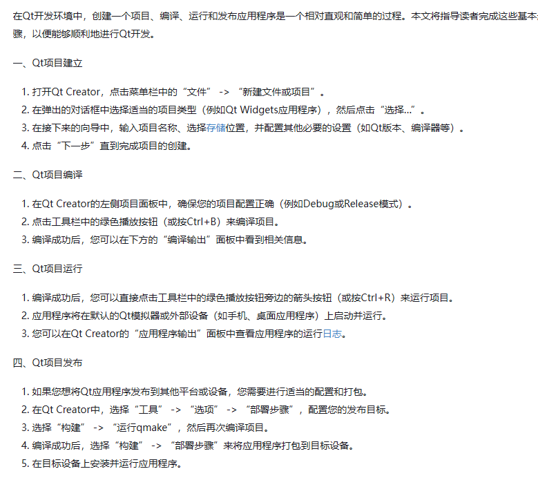

# 深信服
## 1、MakeFile编译知识
如何编译：1-1、MakeLists文件多个一起编译：add_dirctoty(./Mulu)
2、add.library(库名)
3、target_include (包含目录)
4、使用库target_link_libraries(add库名)
5、add_executable(src)
6、axx_aux

## 2、qt creator的创建工程的过程

## 3、为啥还会在 Raft里写线程池
省去初始化过程，较快。即用即取。

## 4、Raft算法项目是 分布式存储数据库  分布式很重要

## 5、多进程 每个人都有独立的新的 0-3G内存

## 6、最大的困难 
1、环境 2、页表

## 四种 cast
1、属性 cast  const_cast： const属性转换  const变量---》非const变量    非const变量----》const变量

2、static_cast  常见数据类型转换，或上行转换(派生类 转基类)  3、dynamic_cast 下行转化(基类转派生类)  4、reinfernet_cast  类似于C语言中的强转，常用来做 指针转化

# 系统从用户态变成内核态
1、中断  2、系统调用  3、异常(page fault/除0运算等)