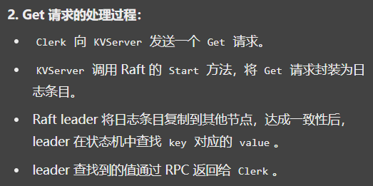
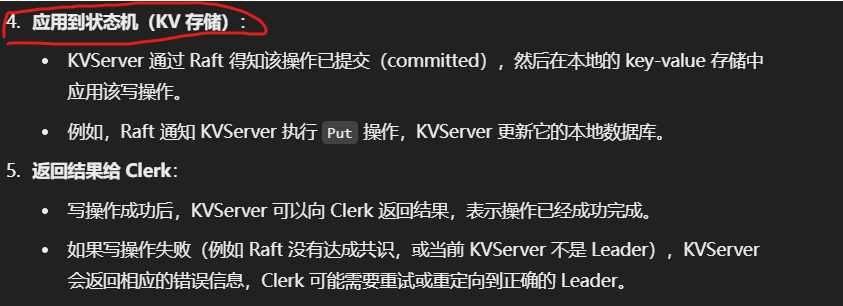
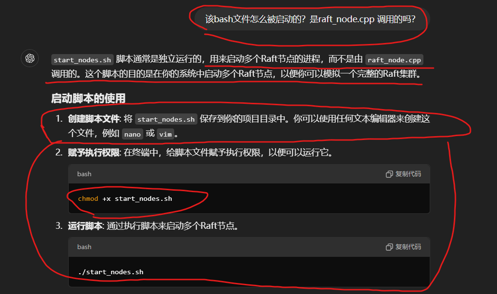
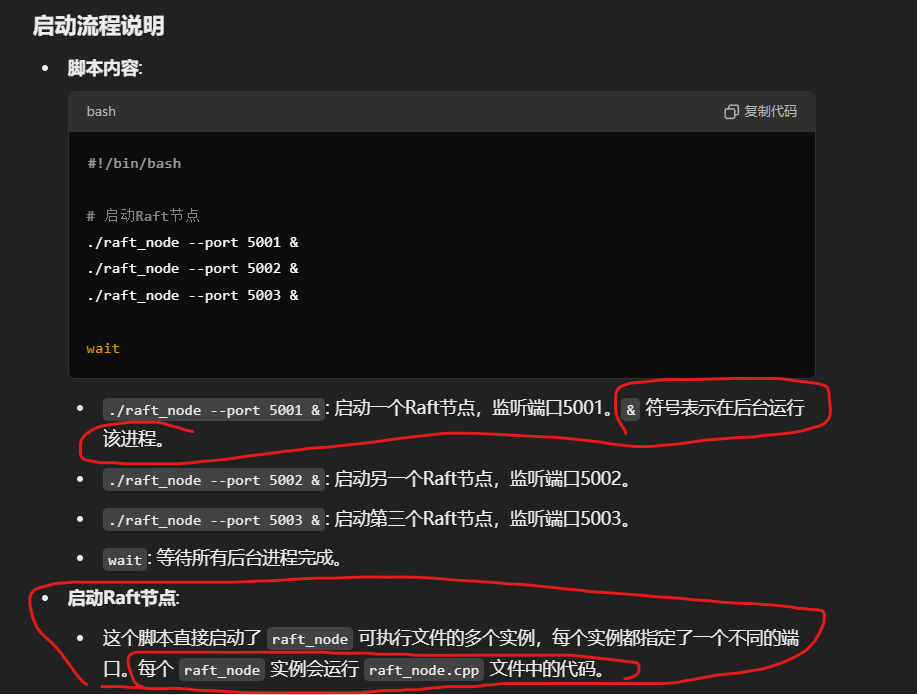

基本框架：


# Clerk
与Raft代表的服务器进行交流：获取和设置 key-value pairs

每一个请求命令：clientId+commandId 组成


**设置号 RPC请求后，直接调用方法即可**

KVStroe 中设置了服务：


# Raft


# kv-server


# Protobuf Definitions
```
syntax = "proto3";

package kvstore;

service KVStore {
  rpc Get(GetRequest) returns (GetReply);
  rpc Put(PutRequest) returns (PutReply);
}

message GetRequest {
  string key = 1;
}

message GetReply {
  string value = 1;
}

message PutRequest {
  string key = 1;
  string value = 2;
}

message PutReply {}

service Raft {
  rpc AppendEntries(AppendEntriesRequest) returns (AppendEntriesReply);
  rpc RequestVote(RequestVoteRequest) returns (RequestVoteReply);
  rpc InstallSnapshot(InstallSnapshotRequest) returns (InstallSnapshotReply);
}

message AppendEntriesRequest {
  string leader_id = 1;
  int32 term = 2;
  repeated string entries = 3;
}

message AppendEntriesReply {
  bool success = 1;
}

message RequestVoteRequest {
  string candidate_id = 1;
  int32 term = 2;
}

message RequestVoteReply {
  bool vote_granted = 1;
}

message InstallSnapshotRequest {
  string leader_id = 1;
  bytes snapshot = 2;
}

message InstallSnapshotReply {
  bool success = 1;
}
```

# RPC Communication


RPC example：Clerk中的 Get()


Get的具体实现：
客户端：


服务端：


proto中 response是一个message { bool success=1; bytes value=2;}


# 对于获取到的 value结果，其返回是  Get函数结束时，自动跟随Response，返回给 Clerk，而不需要 KV-server再构造返回发送函数了


# 好的，那我想再问一下，就是说，kv-server是怎么收到 clerk的get请求的呢？它是一直在等待clerk的发送信息吗？


**网络传输层负责：RPC 框架或网络库负责所有网络通信的底层细节，KVServer 只需实现相应的方法逻辑（如 Get），而不需要关注如何接收或发送数据，框架会自动处理这些工作。**


# kv-server作为KVDB、clerk和Raft节点的连接，那么它是怎么把clerk的操作信息，传给Raft节点，并作为entry保留下来的呢？


举例：




When the Clerk calls the Put or Get method on the KVServer (via RPC), the KVServer's corresponding method is invoked.
**KV-server类中实现**
```
// KVServer method for handling Put requests
void KVServer::Put(const std::string& key, const std::string& value) {
    // Create a new operation (command) to be replicated
    KVOperation op;
    op.type = PUT;
    op.key = key;
    op.value = value;

    // Propose the operation to the Raft node
    int index = raft->Start(op);

    // Optionally, wait for the operation to be committed
    // This can involve synchronization mechanisms like condition variables
    // to wait until the Raft node confirms commitment
}
```

The KVServer uses the Raft node's Start method (or similar) to propose a new command (operation) for replication.
**Raft类中实现：**
```
// Raft node's Start method
int RaftNode::Start(const KVOperation& op) {
    // Check if the node is the leader
    if (state != LEADER) {
        // Return an error or redirect to the leader
        return -1;
    }

    // Append the operation to the local log as a new entry
    LogEntry entry;
    entry.index = lastLogIndex + 1;
    entry.term = currentTerm;
    entry.command = op;
    log.push_back(entry);

    // Update state variables
    lastLogIndex = entry.index;

    // Start the replication process to followers
    // (This involves sending AppendEntries RPCs to followers)

    return entry.index;
}
```

**Raft类中实现**
```
// Leader's method to send AppendEntries to followers
void RaftNode::SendAppendEntries() {
    for (auto& follower : followers) {
        AppendEntriesRequest request;
        request.term = currentTerm;
        request.leaderId = id;
        request.prevLogIndex = follower.nextIndex - 1;
        request.prevLogTerm = log[request.prevLogIndex].term;
        request.entries = log.slice(follower.nextIndex);
        request.leaderCommit = commitIndex;

        // Send the request to the follower (asynchronously)
        follower.rpcClient->AppendEntries(request, &RaftNode::HandleAppendEntriesReply, this);
    }
}
```

**Raft类中实现**
```
// Handler for AppendEntries replies
void RaftNode::HandleAppendEntriesReply(const AppendEntriesReply& reply) {
    if (reply.success) {
        // Update matchIndex and nextIndex for the follower
        follower.matchIndex = reply.matchIndex;
        follower.nextIndex = follower.matchIndex + 1;

        // Check if the log entry is committed (replicated to majority)
        if (IsCommitted(reply.matchIndex)) {
            // Update commitIndex and apply the entry to the state machine
            commitIndex = reply.matchIndex;
            ApplyLogEntries();
        }
    } else {
        // Handle failures (e.g., decrement nextIndex and retry)
    }
}
```

**ApplyLogEntries**
Once an entry is committed, the Raft node notifies the KVServer to apply the operation to the key-value store.
```
// Applying committed log entries to the state machine
void RaftNode::ApplyLogEntries() {
    // 提交一个 commit，就把之前没有提交，但是可以提交的commit都一起提交了
    while (lastApplied < commitIndex) {
        lastApplied++;
        const LogEntry& entry = log[lastApplied];

        // Notify KVServer to apply the operation
        kvServer->ApplyOperation(entry.command);
    }
}

// KVServer applies the operation
void KVServer::ApplyOperation(const KVOperation& op) {
    std::lock_guard<std::mutex> lock(kv_mutex);

    if (op.type == PUT) {
        kv_store[op.key] = op.value;
    }
    // Handle other operation types if necessary
}
```

**Kvserver Response Clerk**
For Put operations, once the operation is applied, the KVServer can send an acknowledgment back to the Clerk.

For Get operations, since reads may not need to go through the Raft consensus (depending on your consistency requirements), the KVServer can read the value directly if it's guaranteed to be up-to-date.
**KV-server类中实现**
```
// KVServer method for handling Get requests
std::string KVServer::Get(const std::string& key) {
    // Optionally, ensure the latest committed state is applied
    // This may involve interacting with the Raft node

    std::lock_guard<std::mutex> lock(kv_mutex);
    auto it = kv_store.find(key);
    if (it != kv_store.end()) {
        return it->second;
    } else {
        // Handle key not found
        return "";
    }
}
```

# 奥，意思就是说，KV-server收到请求后，需要先向Raft节点打报告，然后Raft节点同意操作后，并把entry记录到Logs中，然后commit之后，KV-server才可以去对DB进行擦欧总




**在这个架构下，写操作通过 Raft 保证一致性，而读操作可以直接从本地读取，避免了性能开销。**

**好的非常感谢。最后几个问题：1、对于一个项目具体部署而言，clerk怎么知道Raft节点的ip+端口的呢，可以通过配置文件写好后，让clerk进程去读吗？并且读完之后，clerk每次去与Raft节点进行沟通时，如果发送的请求很多的话，会发生什么事？或者，由于raft集群处理的速度没有clerk发请求的速度快，那么这个时候怎么办？可以用LockQueue队列解决吗？2、对于一个项目具体部署而言，我现在写好了Raft相关的所有文件，我怎么在一台电脑上体现一个Raft集群呢？我需要写一个Producer文件，生成好几个Raft节点的运行进程，模拟集群工作吗？那么，这些Raft节点之间的配置信息要怎么提前共享呢？**


1、


(Json数据样式 读ip+port)


2、


chmod  添加脚本文件的运行权限




# 对于Raft集群，如果出现极端情况，比如一个Leader与其它成员失去联系，那么其它成员会选出一个新Leader，但是旧Leader还会认为自己是Leader，并且，很奇怪的是，Clerk和该旧Leader还保持着正常的通信连接。那么我想请问：clerk如果第一个选择沟通的Raft节点就是该旧Leader，并且该旧Leader因为还认为自己是整个集群的Leader，所以它的状态还是Leader，所以其给clerk  isLeader的反馈是 true。那么我想问，这个时候，clerk向该旧Leader发送Get和Put请求时，会怎么样呢？
其实，如果 raft节点对于任何操作，都必须征得一半以上的节点同一时，该情况不会有影响，因为 旧Leader无法达成此条件。但是，如果对于 读操作，只要保证是 Raft返回是Leader 状态就可以正常请求的话，此情况下：读操作很可能读到旧数据！！！

# 处理clerk请求的同时，“心跳”RPC在同时进行着

