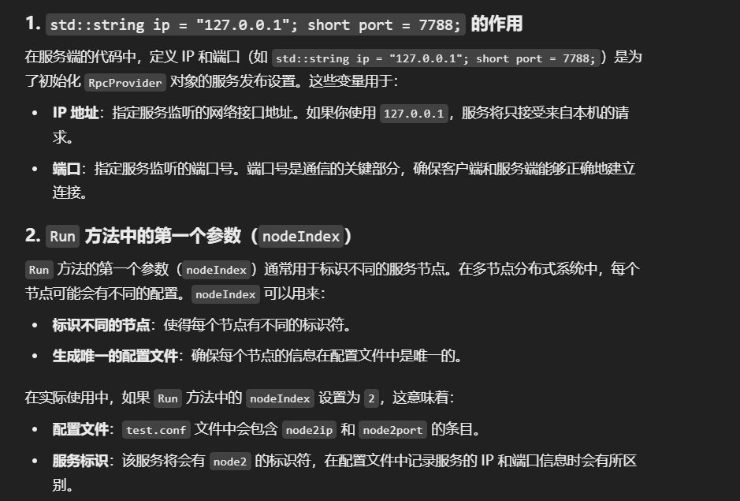

Proto文件中若含有 service，那么如果 不想使用 grpc连接器链接编译则：
proto文件中需要把生成服务的Option打开：


service UserServiceRpc
{
    rpc Login(LoginRequest) returns(LoginResponse);
    rpc Register(RegisterRequest) returns(RegisterResponse);
}

服务生成后： UserServiceRpc_Stub类 给调用方使用        UserServiceRpc类 给服务器 提供方使用

Caller：


Stub需要使用管道 （内部的传输层设置 1、自定义协议 仿照mprpcchannel去写，自定义协议  2、使用 mRpc框架里的 channel设置）
stub.Login 表明要调用的：$\color{green}{UserServiceRpc服务中的 Login方法}$  (stub会和服务进行绑定，然后stub内部可以显示，此服务中可调用的方法)**调用方法时，第一个参数可以传入 controller，然后 RPC的调用结果，可以通过 controller中的状态看出来**

Callee：

第一步 ： 重写 UserServiceRpc类中对应的服务函数


第二步：创建提供对象 RpcProvider 
NotifyService表明自己提供的服务是哪个
provide.Run(1,8888)  是表明，该节点的 Index是1，port端口是 8888，内部绑定的ip，是在Run函数内部 通过函数自动获取本地Ip后进行绑定的


# 那么 前面定义 std::string ip = "127.0.0.1";short port = 7788; 有啥哟？ 并且 Run第一个参数是2的话会怎么样？Run内部的ip和端口信息从何而来，为什么需要写入配置文件？配置文件不是在外面提前写好的吗？配置文件里面的信息是啥？



Server 的服务类的重写，基本都包括：RPC通信+实际的本地业务处理逻辑函数


服务器用到了 rpcProvider类，里面用到了 muduo库进行TCP链接设置，通信设置，数据的格式，序列化格式等。


muduo监听是异步的：


Server服务结束后的 回调函数done：


该回调函数和 Provider中的回调函数：


自定义 Closure


```
#include <google/protobuf/stubs/common.h>
#include <iostream>

class CustomClosure : public google::protobuf::Closure {
public:
    CustomClosure(std::string task) : task_(task) {}

    // 重写 Run 方法，定义自定义行为
    void Run() override {
        // 自定义的服务结束后的逻辑
        std::cout << "Task finished: " << task_ << std::endl;
        // 这里可以加入更多自定义逻辑，比如记录日志，执行其他异步操作等
    }

private:
    std::string task_;
};

// 定义服务中的方法
void GetFriendsList(::google::protobuf::RpcController *controller, const ::fixbug::GetFriendsListRequest *request, 
                      ::fixbug::GetFriendsListResponse *response, ::google::protobuf::Closure *done) {
    uint32_t userid = request->userid();
    std::vector<std::string> friendsList = GetFriendsList(userid);
    response->mutable_result()->set_errcode(0);
    response->mutable_result()->set_errmsg("");
    for (std::string &name : friendsList) {
        std::string *p = response->add_friends();
        *p = name;
    }

    // 调用自定义的 Closure
    CustomClosure customDone("Sending response to client");
    customDone.Run();  // 自定义行为：输出 Task finished: Sending response to client

    done->Run();  // 继续 RPC 框架的默认行为，将响应发送回客户端
}
```

