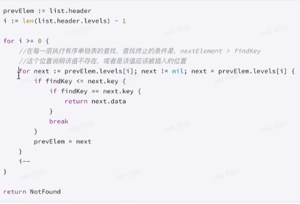
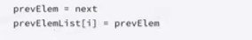
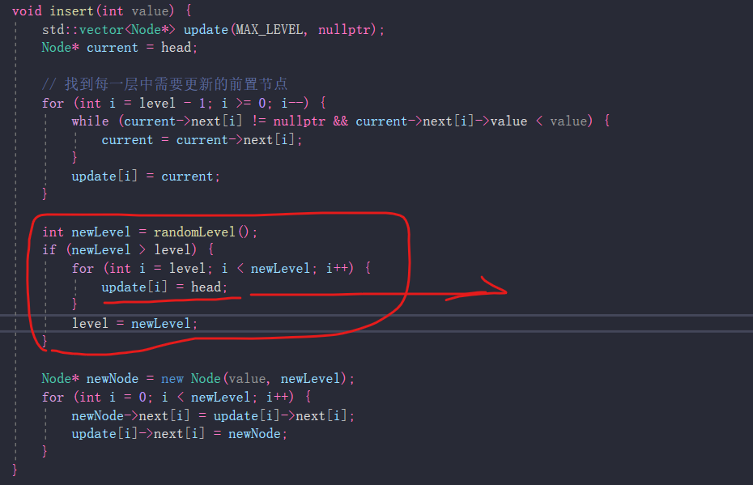
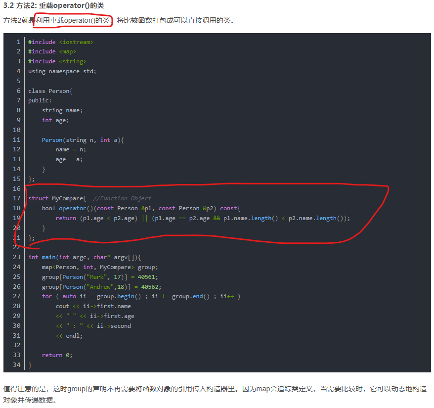

C++中用 C代码  ，在C++代码文件中  extern "C"


tcp：传输控制协议


拥塞控制与流量控制的区别：
拥塞控制是防止过多的数据注入到网络中，可以使网络中的路由器或链路不致过载，是一个全局性的过程。流量控制是点对点通信量
的控制，是一个端到端的问题，主要就是权衡发送端发送数据的速率，以便接收端来得及接收。
拥塞控制的标志：
·重传计时器超时
·接收到三个重复确认
拥塞避免：（按照线性规律增长）
·拥塞避免并非完全能够避免拥塞，在拥塞避免阶将拥塞窗口控制为按线性规律增长，使网络比较不容易出现拥塞。
·拥塞避免的思路是让拥塞窗口cwd缓慢地增大，即每经过一个往返时间RTT就把发送方的拥塞控制窗口加一。

捎带回答（ACK等和发送数据一起发送）；延迟回答（让数据先被处理一会儿）；快恢复


连接异常：
1、关机 进程关闭   正常断开连接；FIN正常发送
2、网络断开；发送方 发现对端不在，则 reset，断开连接  （保活机制，qq重新连接）

close_wait: 被断开方，在收到 FIN 并发出了 ACK应答之后，处于的状态；当我方发出 FIN后，该状态结束
如果有大量 close_wait 状态：


 
改内核 sysctl.conf代码    (TCP 处理是 内核去处理的，所以要改 内核配置代码)


长连接和短连接：


UDP：
没有发送缓冲区。因为不支持 重发送


16位的最大长度表示，所以报文最大是  64K

# Skip_List

所有层的Node，构成一个完整的 Node

**有序单链表的查找情况：**


每一层往右走，是一个 Node集合在往右走


插入的 记录每一层，前面的 Node节点 


preElements是一个数组



往上新增的 层数：的update[i]前驱节点一定是 Head


红黑树和散列表：


# 单例模式


# 构建模式


# 工厂模式


# visual_studio 中的函数的安全模式
涉及到 字符串的，好多  filename_s  这个s大多是对于 缓冲区大小的考虑，所以其相比于 filename 函数，基本上都多了一个 **对应的缓冲区大小的参数**

# map的key若要是自定义的数据类型
则需要 对 **比较规则** 进行**重写**或重写规定


有了比较函数Compare，则可以比较两元素键是否相等

### 方法1  自定义数据结构 重载 <


这样 map存储元素时，不需要在 map定义或初始化时做其它操作

### map 修改less比较对象
#### 1 利用 function对象

```
map<Person,int,function<bool(const Person&,const Person&)>>M1(compare);
```
我们利用std::function为compare()构建函数实例。初始化时，这个函数实例就会被分配那个指向compare的指针。因此，在对M1进行声明时，需要构造函数指明函数实例。

#### 2 利用 重载 operator() 类

值得注意的是，这时group的声明不再需要将函数对象的引用传入构造器里。因为map会追踪类定义，当需要比较时，它可以动态地构造对象并传递数据。
**const不可缺少！！！！**

#### 3 利用 less函数的模板定制


仿函数 / 谓词 作为对象被调用，且是 在重载了 () 的情形下被调用，这样就可以看作是一个**函数调用**


#### 模板特化 
完全特化：模板参数全部 被定义


部分特化


应用
模板特化常用于：

优化性能：为特定类型提供更高效的实现。
定制行为：根据特定类型调整类或函数的行为。
特化使得模板的使用更灵活，能够满足特定的需求和场景。


当用int作为参数，去实现 模板类 TestClass时，实现的是 **特化了的类 TestClass**(func 输出： int Type COUT)

# unordered_map的key要是自定义的数据类型
则需要对 
1、判重需要重新规定  不允许 key元素重复
2、其底层是一个散列表，需要先进行hash化，所以还需要对 hash规则重新进行规定

Pred谓词：equal_to 判重需要重写； Hash规则：hash需要重写

```
对于unordered_map而言，当我们插入<key, value>的时候，需要哈希函数的函数对象对key
进行hash，又要利用等比函数的函数对象确保插入的键值对没有重复。然而，当我们自定义类
型时，c++标准库并没有对应的哈希函数和等比函数的函数对象。因此需要分别对它们进行定义。

因为都是函数对象，它们两个的实际定义方法并没有很大差别。不过后者比前者多了一个方法。
因为等比函数的函数对象默认值std::equal_to<key>内部是通过调用操作符"=="进行等值判断，
因此我们可以直接在自定义类里面进行operator==()重载（成员和友元都可以）。
```

#### 1 利用function方法

**（100 初始化 桶数，不能少）**


**decltype  可以捕获函数的 function类型：返回值+参数** 
decltype(&func_name)   获取 函数 func_name 类型

但是只能获取**有名函数**的类型

像 lambda就不行


#### 2 将 hash函数打包成 可调用的类


#### 3 模板定制


当模板特化后，符合特化参数的模板进行实例化时，会选取 特化模板进行构造


**std**命名空间中 有 **equal_to** 和 **hash** 模板


当作为 谓词和仿函数被使用时，重载对象 重载的是  (): operator(const object& Obj) const{}