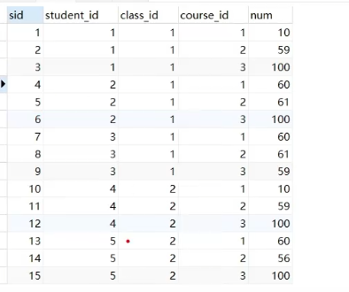
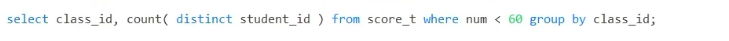
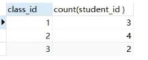
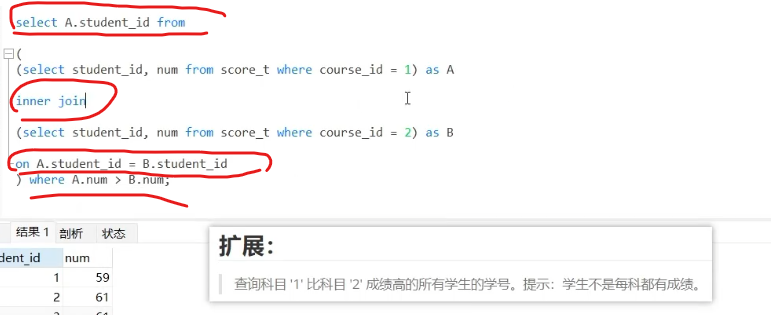
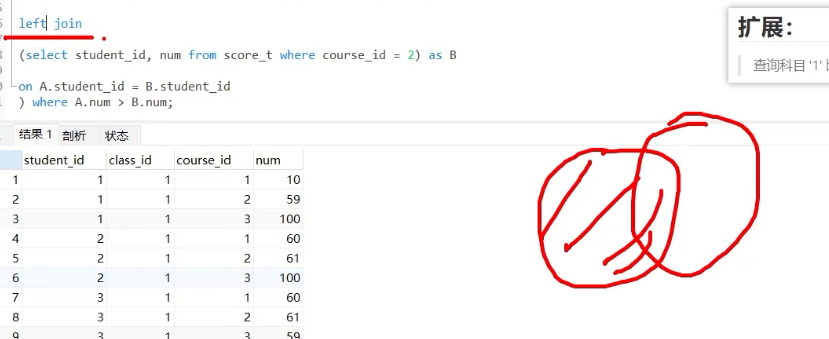
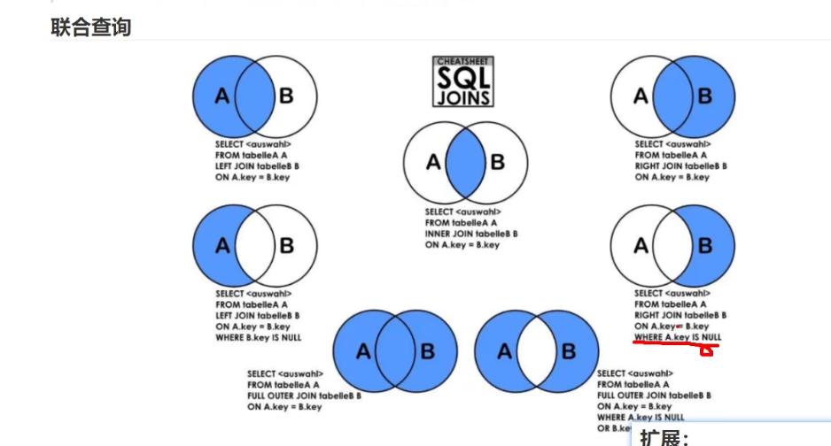

# 算出每个班级中 不及格的人数，并按班级分组   
distinct 关键字：去除 重复的 学生id ，因为 默认的是 如果 一个学生 有多个科目列表不及格，则 该学生会被重复记录
因为它的表是这样的

（如果 要求 一个人多个科目不及格，则算作多个人，则 不要关键字 distinct）

# select 语句可以对  select出来的集合进行操作 

1 select ***  as A  设为集合A

2 inner join 求交集

3 然后 on是交集的条件 因为集合中 对象的属性很多，你得有一个作为依据来 求交集  （还可以 成绩一样求交集 年龄一样求交集啊  等等）

# 拓展 join可加参数 等等 
left join  A/(A∩B)  A左边独有的部分

# sql语句 允许 运行时判断， 如果运行到某处 b.num为空，则 b.num设为0
