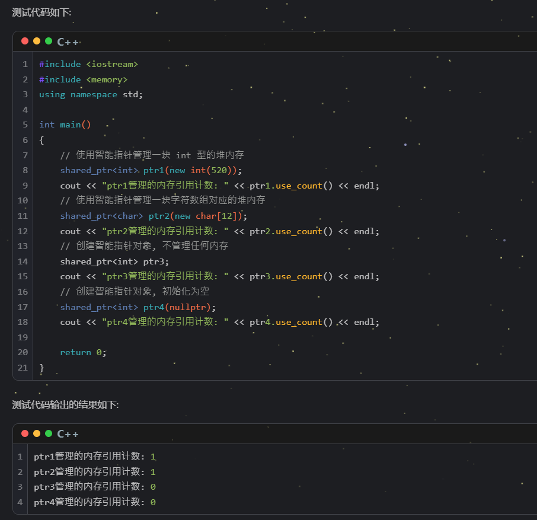
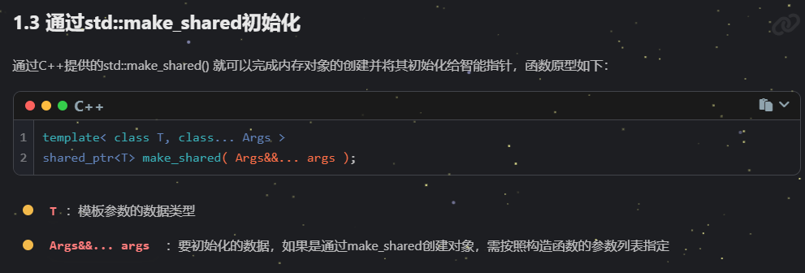
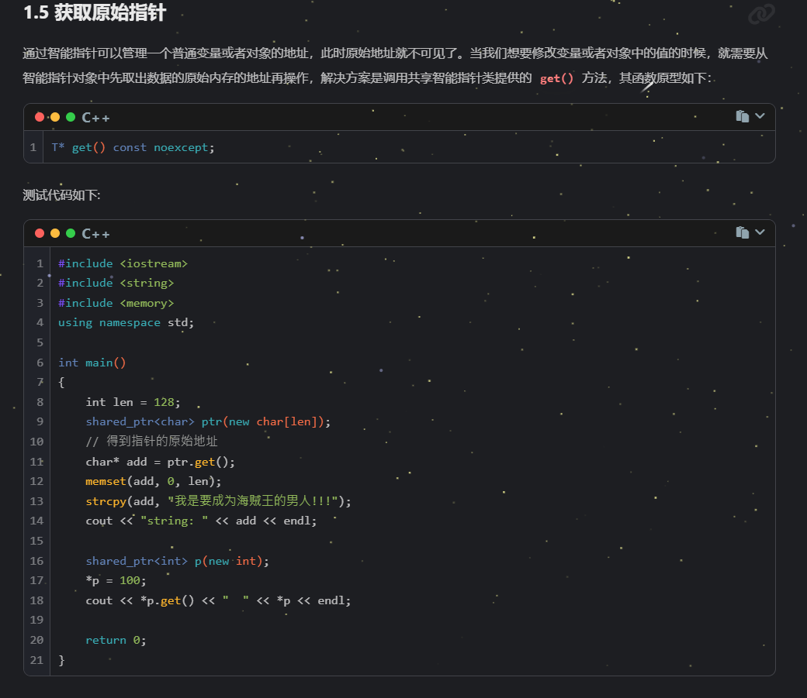
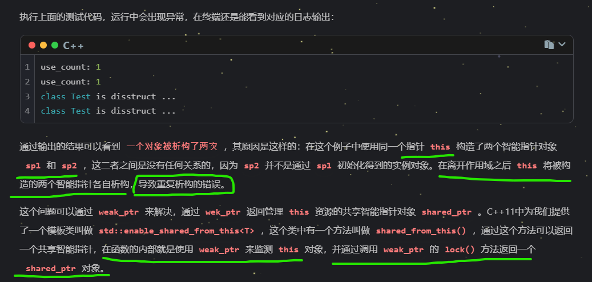

# shared_ptr

## 构造
1、**普通构造函数**

2、**拷贝构造**
拷贝构造 无论显示隐式，都创建了一个对象
但是 移动构造并没有创建新对象

3、**make_shared**
创建对象的同时，就初始化给智能指针
（智能指针 本质还是给你一个对象，并且可以在对象 不再使用的时候，将其delete）

4、**reset初始化**

示例：

可用于ptr初始化：对于原先指向的对象内容（若有），其引用--；然后 ptr获得新的 对象的引用，并使得此对象引用+1;如果 reset没有传入参数（没有要剥夺的对象的指针引用，则引用为0）

5、**获取原始指针**

## 删除

1、指定删除器

数组对象 一定要有自定义删除器（函数对象）

自定义  shared_ptr_array 嵌套 shared_ptr  返回的对象默认设置好：可删除数组的删除器 delete[]或者 设置 default_delete<T\[]>()    （原先的 default_delete<T\>() 中的 模板T设置成  T[]）
 

# 独占式指针
unique_ptr<int\>uptr1 
不允许拷贝构造，但是可以 通过函数返回 和 转移move赋值

## reset 解除管理 或 初始化

## get 获取被管理的地址

## 指定删除器时要指定函数类型 （返回值 参数）

function<Return(Arg...)\>       包装器：返回值类型(形参...)

放到同一容器：前提是 写包装器时，返回对象和形参一致

**包装器调用函数，只实例化一份模板函数对象**

### 奥 其实，是模板函数在被调用时，会按照参数的不同，示例出不同的对象：
#### 对于模板函数 testTemp：传入参数不同 示例函数对象不同

#### 两种类型的 t传入，会示例化出两种类型的 模板函数

#### 输出结果如下：

而包装器会使得参数都统一成 包装器 类对象，所以只实例化一份模板函数对象

#### bind 配合包装器   调整参数顺序
实现 5-10 和 10-5   p1和p2代表的是，rSub传参时，的参数1和2；然后 p1和p2对象所处的位置，按照顺序传给绑定的函数 Sub（p1，p2） Sub（p2，p1）   也就是说 Sub（被绑定函数）的参数顺序，就是按照 bind时，p1和p2的位置参数顺序；但是  p1 和 p2的赋值是固定的 rSub的 **参1和参2** 赋值给 **p1和p2**

#### 绑定成员函数：静态函数 非静态函数bind        需要先获取被绑定函数地址  （其实前面 普通函数绑定时 函数名就是函数地址，只不过 这里不同类的函数，函数名可以一样，所以需要加上 类名做限定）
$\color{red}{静态成员函数}$在 bind时，可以没有 类对象，但得表明 绑定的函数是 类中成员函数 &类名::函数名
$\color{red}{非静态成员函数}$  第二个参数要传入 类对象 无论是**匿名对象**或**有名对象地址**

# 弱引用指针

构造

#### use_count() 返回监测的区域的引用计数

weak 仅仅是监测资源，并不能引用使用资源         （注意 unique_ptr 都不允许其它人监测！！！）（weak_ptr的构造函数中，就没有关于 unique_ptr的）

#### expired() 返回true表示资源已经释放；否则 资源未被释放

#### lock()  拷贝一份资源 返回值是 shared_ptr ，所以需要 shared_ptr 去接收 （注意是拷贝，会导致 资源引用计数++）

#### reset() 不再监测任何资源

因为 不监测任何资源，所以 expired返回值为 true，所以 **其实，你可以把expired看作当前 weak指针，是否监测空资源**（shared_ptr不再指向的资源，会被释放！！变空）

#### 可返回this 对象的 shared_ptr
对于 shared_ptr而言  shared_ptr(this) 是创建一个新对象 并不是对同一个this对象进行引用

修改代码，利用 内部是 weak_ptr 的lock方法的类  shared_from_this();

** 初始化的要求是 继承时说明 父类的模板的数据类型 为Test**   这也是 当所有的 基类是模板类时，子类继承时要做的事

例：

#### 解决循环引用问题

相当于  四个指针 对两个对象指向 但是最后共享智能指针离开作用域后，每个对象的引用计数只能-1 ，所以对象无法释放 引用计数只能 -1的原因是：指针 **ap** 和 **bp** 的销毁，不会直接导致 对象的销毁，对象存在，则对象中的 **aptr** 和 **bptr** 依然存在； 对象被指针给指向，则对象又无法被销毁....因此 形成一个死循环，对象无法销毁！！！！

（上图也说明 TB对象销毁后，其内部的 aptr指针才会被接着析构）

####

try **内部的函数，相当于是保护哪一个函数，（接住 哪一个函数抛出的异常）**