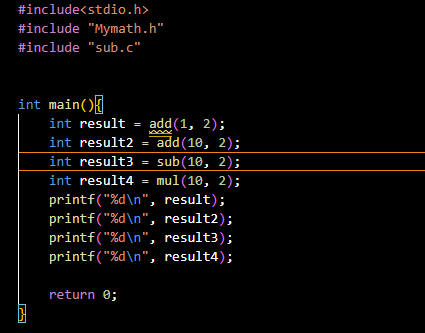
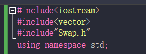

# Cmake make
**.c 文件 要变成 可执行文件 **
需要：预处理 编译 汇编 链接    （链接器链接）
如果 只是一个.c文件，那直接 gcc -c  **.c -o ** 即可生成可执行文件

但是 如果源文件太多，一个个写太慢。所以 需要 **make**帮助，它可以帮助我们自动输入**文件处理命令**，然后，其依据的规则是**makefile**；
但是，编写makefile也是复杂的，且随着平台的改变，还需要调整，所以人们又创造出 **Cmake**,
来帮助我们创建makefile文件，并可随着平台改变自动调整；Cmake操作的依据是**Cmakelist**文件；
Cmakelist文件需要程序员手动编写

### 高效聪明复杂的写法 去 替代那些  重复机械笨蛋式的 写法
Cmake写法 是真复杂； 就像人们 第一次 用 for循环，去替代重复写 1000 10000行机械式代码

# 学习目的：了解 底层编译原理  了解 Cmakelist Makefile文件如何编写

# include包含文件时：
“”文件从当前目录下找  <> 文件从内核规定路径找

# Vscode  或者就是在 Linux环境下 普通gcc编译
分文件编写时：需包含文件 .c ,之后才可以 进行 gcc 编译，如果 .h ，会报未定义（注意 重复定义的问题，所以 需要在  src的.h文件中 写上**ifnodef def endif 的宏定义！！**）;而如果，把资源文件都变成库，则可仅仅使用 库文件的 .h，进行gcc编译 如下图 Mymath.h

Linux环境下：
变成静态库：ar rcs libmylib.a  Mymath
利用静态库编译：gcc Acculate.c libmylib.a  -o Acculate

# Vs中  编写C++/C 仅仅包含.h文件即可      
本质上 还是因为 vs是包含预处理编译汇编连接等等及一身，并且 其文件包含关系和vscode不一样，因为你看 vs中 多个文件都有main函数时，你在一个文件里 按 Ctrl+F5 会报错：发现多个 main入口 （vs 是把整个工程下的文件都看作一起的，一起进行编译和连接）

