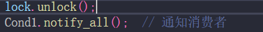

# mutex

####  lock_guard 自动解锁 
lock_guard<mutex_type&>name(mutex&m);
如 mutex  lock_guard\<mutex>name(m1);
如 mutex  lock_guard\<recursive_mutex>name(m1);

#### unique_lock<mutex>(m1);

lock_guard  和 unique_lock  都不是新的锁的类型，只是用锁的两种方式  创建两种 管理锁的 **对象**：
```
unique_lock 和 lock_guard 都是用于管理 std::mutex 的锁机制，但它们提供不同的功能和灵活性。它们并不是新的锁类型，而是用于操作现有的 std::mutex 的工具。让我们详细解释它们的区别和用途。

std::unique_lock
灵活性：std::unique_lock 提供了更灵活的锁管理方式。你可以显式地锁定和解锁，支持延迟锁定（即在构造时不立即锁定），以及手动解锁。

条件变量：它与条件变量配合使用时非常方便。条件变量的 wait 和 notify 操作需要 std::unique_lock，因为 unique_lock 支持临时解锁和重新加锁。

构造函数：std::unique_lock 可以接受一个布尔参数来延迟锁定。例如，你可以先创建一个 unique_lock 对象，而不立即锁定它，然后在需要的时候再锁定。

解锁：可以在持有期间显式解锁和重新锁定（调用 unlock 和 lock），这在一些复杂的场景中非常有用。

std::lock_guard
简单性：std::lock_guard 是一个更简单的锁管理工具。它自动在构造时锁定，在析构时解锁。它不支持显式解锁或重新加锁。

适用场景：适合在简单的锁定需求下使用，确保在作用域结束时自动解锁，避免遗漏解锁的风险。

限制：std::lock_guard 不支持与条件变量配合使用，因为它不允许解锁。
```

注意 ： 管理锁对象 

在被 析构时，会解锁！ 而 unique 不仅可以在 初始化时加锁，析构时解锁，还可以 用其内部方法，自定义 解锁和加锁 , 但是 注意 若 unique_lock 初始化时 默认是加锁行为，所以 若这之后 里面用 unique对象进行加锁行为，则会抛出异常或死锁！！！

```
对于 std::unique_lock<mutex> LL(m1);，LL 是一个管理 m1 锁的对象。你可以通过 LL.lock() 和 LL.unlock() 来显式地锁定和解锁 m1。关于你的问题，以下是更详细的解释：

std::unique_lock 的用法和行为
std::unique_lock<mutex> LL(m1); 初始化时的行为：

当你使用 std::unique_lock<mutex> LL(m1); 时，构造函数会默认立即锁定 m1。因此，m1 会被锁定。
如果在创建 LL 时，m1 已经被其他线程锁定，LL 的构造函数会阻塞，直到 m1 被解锁为止。
LL.lock() 操作：

如果在 LL 构造之后立即调用 LL.lock()，将会报错，因为此时 LL 已经持有了 m1 的锁，尝试再次锁定会导致死锁或者抛出异常（std::system_error）。
LL.unlock() 操作：

你可以安全地调用 LL.unlock() 来解锁 m1。在这之后，如果你再次需要锁定 m1，你可以调用 LL.lock()。
```
如：


```
总结
默认构造锁定：std::unique_lock<mutex> LL(m1); 默认会锁定 m1。如果之后直接调用 LL.lock()，会导致错误。
延迟锁定：使用 std::defer_lock 标志可以延迟锁定，并允许你在需要时手动调用 LL.lock() 和 LL.unlock()。(使用 一个返回为bool类型的函数 用作是否延迟锁定 （匿名 有名的均可）)
手动管理锁：std::unique_lock 允许灵活的手动锁定和解锁，非常适合需要复杂锁管理的场景。

```
（而这里**条件变量**和Linux有所不同：Linux没有 unique_lock 管理锁对象的概念，所以 它是 通过 mutex直接进行操作的。所以 m1.lock 和 m1.unlock 需要自己操作，可以把握锁的粒度 在消费者 生产者结束某次工作后，要记得 释放锁）

```
#include <iostream>
#include <thread>
#include <mutex>
#include <condition_variable>
#include <chrono>

using namespace std;

struct ListNode {
    int Val;
    ListNode* Next;
    ListNode* Pre;

    ListNode(int v) : Val(v), Next(nullptr), Pre(nullptr) {}
};

ListNode* head = new ListNode(0);  // 初始化头节点
ListNode* cur = head;  // 当前指针指向头节点

mutex l1;  // 互斥锁
condition_variable Cond1;  // 条件变量
bool flag = true;  // 控制消费者的运行

void Producer(int count) {
    for (int i = 0; i < count; i++) {
        ListNode* temp = new ListNode(rand());  // 在堆上分配新节点
        unique_lock<mutex> lock(l1);  // 加锁
        cur->Next = temp;
        temp->Pre = cur;
        cur = cur->Next;
        cout << "I have created one Production~~" << endl;
        Cond1.notify_all();  // 通知消费者
        this_thread::sleep_for(chrono::seconds(3));  // 模拟生产过程的延迟
    }
    this_thread::sleep_for(chrono::seconds(10));  // 生产者完成后等待一段时间
    flag = false;  // 生产结束，通知消费者退出
    Cond1.notify_all();  // 通知所有消费者
}

void Consumer() {
    while (flag || cur != head) {  // 消费者循环，直到flag为false且所有产品都被消费
        unique_lock<mutex> lock(l1);  // 加锁
        while (cur == head && flag) {  // 如果没有产品且生产者还在工作，等待
            Cond1.wait(lock);
        }
        if (cur == head) {  // 如果没有产品并且生产者已经停止工作，退出循环
            break;
        }
        ListNode* temp = cur;
        cur->Pre->Next = cur->Next;
        if (cur->Next) {
            cur->Next->Pre = cur->Pre;
        }
        cur = cur->Pre;
        cout << "This thread id:" << this_thread::get_id() << " --- ";
        cout << "Get result: " << temp->Val << endl;
        delete temp;  // 释放节点内存
    }
}

int main() {
    cout << "It is ok" << endl;
    thread t1(Producer, 10);
    thread t2(Consumer);
    thread t3(Consumer);
    thread t4(Consumer);

    t1.join();
    t2.join();
    t3.join();
    t4.join();

    delete head;  // 释放头节点内存

    return 0;
}
```

#### 条件变量方法中  wait会进行解锁操作；但 notify 操作不会，而生产者中，每次生产结束后，产品可以被 消费者获得，是因为，for 循环每次结束，unique对象会被析构一次（这也是 unique对象创建依据 RALL机制的原因）；所以这是 锁打开，消费者获得锁！！！而消费者 消费之后，wait方法 会进行解锁操作  
(对于上述 生产者和消费者模型的输出现象来看：生产者 生产后，睡得这3s内，产品不能被消费者获取！（锁此时还在 生产者那）尽管已经通知了消费者)
而如果在  notify之前，ll进行了unlock操作，那么在通知后，消费者会立马获取到 production产品，不会等生产者睡眠3s后，才取得产品

RALL 机制：资源获取 初始化


####  递归锁 允许同一线程 递归后获得同一把锁


#### 超时锁


#### 递归超时锁


超时锁：try_lock_for(timeout) 在超时之后，若没有抢到锁，则返回 false；
普通互斥锁 mutex，在 try_lock()那一刻，没有抢到锁，则直接返回false，抢到锁则返回 true；
并不会阻塞等待


# 条件变量 
condition_variable 需要 unique_lock （unique_lock<mutex>）

condition_variable_any 任意类型 mutex （ 普通  超时  递归  递归超时）


#### condition_variable  


Predicate 是否继续执行 谓语  （return true：则继续执行，非阻塞）（return false 则阻塞等待，不继续往下执行）

匿名函数 Lamda  生产者在没到 maxSize时进行生产； 消费者在 队列不为空时，继续往下执行，进行消费


（注意 Predicate这里是  是否继续执行的意思！！！）

#### condition_variable_any
可以直接作用到 mutex 的粒度；而非 一定需要  管理锁对象 unique_lock

此处的 lock_guard 仅仅是用作 mutex 上锁的操作
下方的 wait可看出，是直接作用于 mutex锁： m_mutex


# 原子类型  atomic 
内部通过 CAS 指令保证原子性   （comapre and swap）  通过比较内存地址是否是前置值，然后修改 内存中值为 新值


# 异步  多线程中 获取线程执行结果，较为麻烦，不可以直接通过 join 获取返回值；一种方法是定义 全局变量 然后线程结束后，可查询作用结果
同步：对顺序有讲究，有约束
异步：更自由


### 获取线程执行结果 ： future 类  promise 类 (内部是一个维护的值)


promise 类内部 有一个 future 对象


注意 promise 使用有几个细节注意：

1、主线程 传入 p1时，时需要进行 ref操作的，因为 promise对象不可被复制 （所以 值传递不行  值传递是 重新复制了一个对象量）


2、p1.set_value 是设置操作完成后，就将结果传出 

而 set_value_at_thread_exit(value) 将会在 子线程结束后将设置的值返回 

注：这里 thread t1([](promise<int>&p){p.set_value_at_thread_exit(100)},ref(pr));
中的 ref(pr) 参数，是t1初始化时的参数，表明 把 pr 引用传参给 lamda函数


### packaged_task 类 内部包含 任务函数 （可调用对象）
packaged_task内部也有 future对象


task包装的是一个 Lamda 匿名函数 ，task变成可调用对象后，task.get_future 可返回一个 future
```
// packaged_task<int(int)>task([](){});
```

### async  (sy/no/mic) 
返回值 是 future


1、使用方式1 调用 async()函数 直接创建线程执行任务


f.wait_for()  和 f.wait_until()  可仅仅只阻塞 一定的时间，并返回一个 fature_status


2、调用 async()函数不创建线程执行任务  只有后序 f调用了 get 或者 wait （wait_for 不行）时，才执行任务（相当于在 主线程中执行到了 get语句和wait语句才去执行任务）


注意 ：返回值 是一个 future\<template> 数据，其中 template的类型，决定了，async 任务函数的返回值类型


当future 模板是 void 类型数据，则 f.get()  可以用作 阻塞，等待子任务执行结束，但是 没有返回的东西，所以 不能进行 cout 等操作！！（get没有返回对象）
