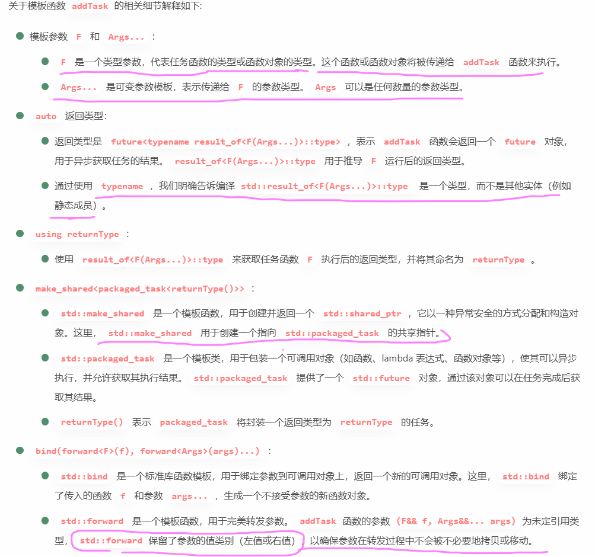

# 线程池 

bind 的好处： 生成的对象可看成 无参的了

如：addtask函数 接收的 function只能是 void() ，所以若直接传参则只能传 下图Printf 函数这种；而bind，可以使得 calc 变成 func 对象进行传参


## 同步线程池  
阻塞等待 子任务执行结束 
1、exitNumber代表有线程要结束。现在:这里是如何保证，在 m_exitnumber>0的时候，get_id获取到的就是当前要退出的线程呢


**thread 结束？ 只要 其 hander处理函数结束了，则 thread 工作结束**

（进入 m_exitNumber>0 判断为真的执行逻辑中后，会执行 return，然后 对应的工作 线程就结束工作了！！！！）

所以：线程如何一直工作？hander函数 有while循环！！


## 异步线程池
可以在 子线程 set 时就获取到结果
但是注意 在 future 和 promise packaged_task async等使用中的几个问题：
如：下图

问题1：Promise 不能复制 不能复制  不能复制
所以  在 SetValue传参时，形参只能是  引用 & 或者 右值移动 &&
问题2：Promise 和 future的生命周期内只绑定一个 **value** 所以像这种 一个 promise future对象，循环使用，会抛出异常
问题3：子线程 没有join

更改：


该 addtask函数：


#### 1、首先第一点  
返回值定义 auto 的函数 ，可以 用  
-> 表明返回值是何种类型 （当然你不写也行）


#### 其它： F 就是要执行的任务函数 Args 是任务函数的参数



我们关键的就是 封装一个 task 对象

##### 然后 首先 task 是一个 shared_ptr：自动析构释放 其指向的对象类型是 packaged_task
所以  
```
//auto task =make_shared<类型>(初始化);
auto task = make_shared<packaged_task<returnType()>>(bind(forward<F>(f), forward<Args>(args)...));
```

##### res = task->get_future();
task 中 执行函数 执行时，set_value 时就直接返回结果了


