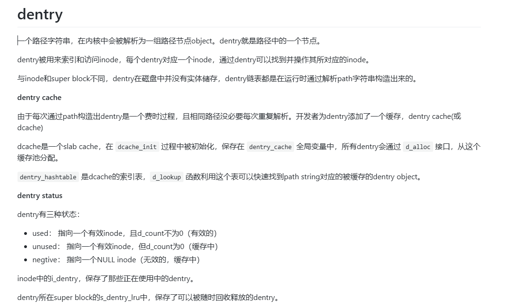
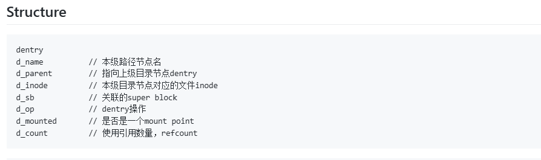
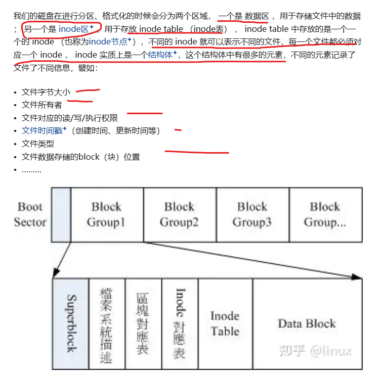
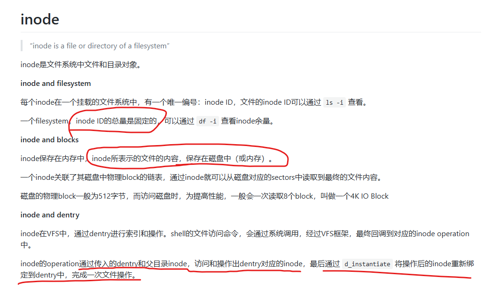
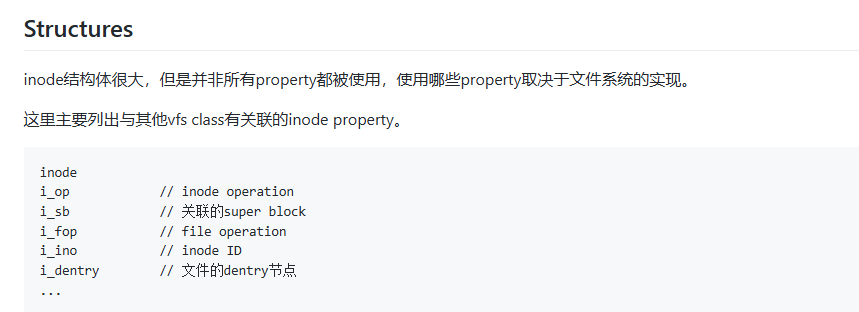
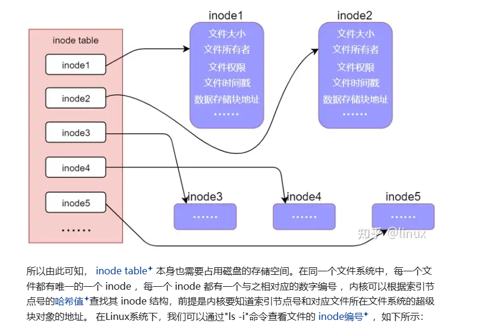
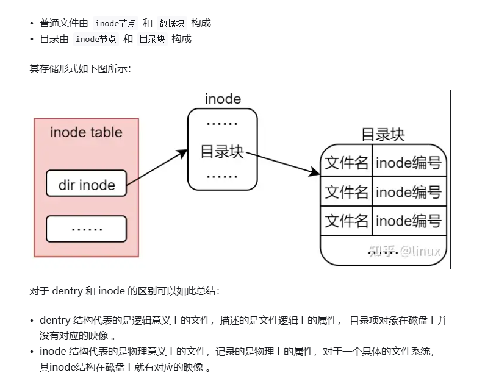
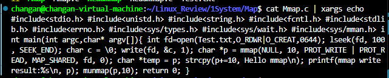
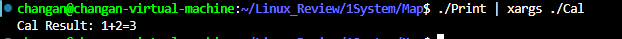

# block inode dentry
1、首先 block 这没什么好说的了，就是底层磁盘存储文件信息及文件的playload数据信息的单位 

2、inode 文件在磁盘中存在的对象。 inode 块中信息，表明磁盘块中属于此文件对象的块是哪些块

3、dentry，被用来索引和访问 inode，每个dentry对应了一个 inode，通过dentry可以找到并操作对应的inode。

注意：一个路径字符串，在内核中，会被解析为一组路径节点 object，dentry就是路径中的一个节点。 与 inode 和 super block不同的是，dentry在磁盘中其实没有实体存储，dentry链表都是在运行时通过解析 path 字符串构造出来的




inode：








# xargs 的有趣使用
把  **终端输出**  转为   **终端输入**

1、不仅可以给 一般的系统调用使用


2、可以进行   可执行程序运行时直接的传参！
有一个  print 程序：
其内部代码如下
```
#include<stdio.h>

int main(){
    printf("%d %d", 1, 2);

    return 0;
}
```

另外有一个 Cal 程序：
其内部代码如下
```
#include<stdio.h>

int main(int argc,char* argv[]){
    if(argc==1){
        printf("No Argumetns! exit\n");
    }else if(argc<=2){
        printf("Test Failed Plase Restart\n");
    }else{
        int a = *argv[1] - '0';
        int b = *argv[2] - '0';
        printf("Cal Result: %d+%d=%d\n", a, b, a + b);
    }

    return 0;
}
```

通过 xargs 可将 print的执行结果，作为输入参数，传递给 Cal程序执行


注意：  对于 一个字符串  str指针 p来说 ，  printf p 则打印 str字符串; 而对 p进行解引用，则结果相当于  str 的首字母！！