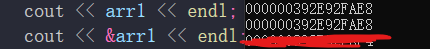
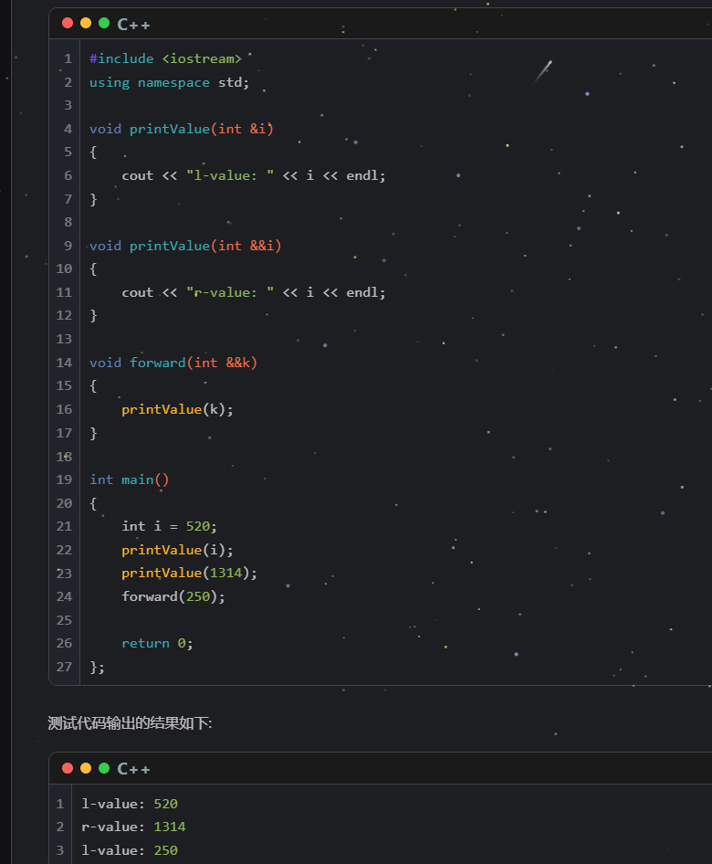

# 怎么强制不让结构体对齐

结构体对齐：方便CPU查找；因为 cpu的查找，为了提高效率，不是一个一个字节来的

# 计算要匹配
1、n+=(1<<3)    对n进行位运算：第3位+1
2、对于下列情况：
```
int a[] = { 2,4,7,9 };
int* p = (int*)(&a +1);
cout << "sizeof A:" << sizeof(a) << endl;
cout << *(a + 1) << endl;
cout << (&a + 1) << endl;
cout << (p - 1) << endl;
cout << a << endl;
cout << p << endl; 
cout << *(p - 1) << endl;
```

首先：
    加减计算，要统一单位，这里的&a+1，不是简单进行+1（因为 没有意义，在内存对齐的情况下，a的地址+1,指向的是a数组中 1/4处的整型数据‘2’？？），而是按照a的大小进行计算，这里的size=16，所以&a+1，相当于地址偏移一个a的大小，所以：&a+16；
再注意：对于指针而言，其加1减1的，受其指向的数据类型有关：切记！！！！！！！！！！
如：int* p; p+1 ---> p的值加4
所以 p-1，相当于-4；所以综合起来：
    上述 p=（int*)(&a+1)后，*(p-1)=9

    
$\color{green}{注意 a+1和\&a+1是不一样的！！,a表示的是int*，如果其+1，则对应10进制是+4；\&a+1是a的地址再加一个a数据结构大小的值（sizeof(a)=4*4）}$

$\color{green}{注意注意，前面说了 四则运算时，数据要匹配，这里\&a+1可以，编译器认为这是普通的整数计算，所以想要赋值给*p，还得进行int *的类型转换。但是,a+1不行，编译器认为这属于数组+1}$

&数组名 = 数组名 = 数组的地址 = 数组的第一个元素的地址


$\color{red}{而：数组名直接+1，是前进到 下一个元素位置； \&数组名+1，是直接越过整个数组的范围}$


# 模板T 可以有 默认类型  
\<template T=char\>     然后,当在函数中 无法自动推导出函数类型时，会使用此默认类型！ 但是  函数传的参数的默认初始值，不会作为模板参数推导依据    

```
<template T,template U=char> 
void fun(T=100,U=100){
    cout<<U<<endl;
    cout<<T<<endl;                // 报错 因为T无法自动推导出来类型，且没给出 默认参数 （形参 100不能作为推导依据（100可以是 int 也可以是 'd'）  归根到底：自动推导时，不能有歧义）
}

```

# assert 断言  （相当于强制判断语句，若此处断言结果为假，则程序退出）

如： assert(size>0);         (程序运行到此处时，size若《0，则退出)

静态断言：不同环境下断言结果不同，需要等程序跑在一个确定的环境/平台下，才可确定：

assert(sizeof(long long)==8);   $\color{green}{用来判断程序是否在64位环境下运行，若不是则退出程序}$

# throw 抛出异常   noexcept 在函数后面修饰，表明此函数不会出错，若出错，则终止程序运行
***   throw ***; 抛出异常  try {执行逻辑}  catch (抓住异常信息) {执行逻辑}  catch(抓住抛出的异常变量){执行逻辑}

noexcept 后可跟参数
noexcept(true)     表明函数不会异常
noexcept(false)    表明函数可能异常

```
struct MyException
{
    MyException(string s) :msg(s) {}
    string msg;
};

double divisionMethod(int a, int b) throw(MyException, int)
{
    if (b == 0)
    {
        throw MyException("division by zero!!!");
        // throw 100;
    }
    return a / b;
}

int main()
{
    try
    {	
        double v = divisionMethod(100, 0);
        cout << "value: " << v << endl;
    }
    catch (int e)
    {
        cout << "catch except: "  << e << endl;
    }
    catch (MyException e)
    {
        cout << "catch except: " << e.msg << endl;
    }
    return 0;
}
```


# auto
有时候很像自动“补全”

int temp=250;

auto p=temp;        // auto = int  (因为p的类型是int)

auto *p=&temp;     // auto =int （因为p的类型是int\*）

auto p=&temp;      // auto =int*（因为p的类型是int\*）

# new
我们学完内存管理后，再回头看 new： 再堆上new出一个对象，new出什么样的对象，是看 new后跟着的是什么：
1. new int[10]  new出一个整型数组   $\color{green}{注意：new后跟着的都是 定义过的变量，直接匿名，不用 你再加什么变量名了，new int arr[10]}$
2. new Person();       $\color{green}{创建一个Person对象}$
     **那其实这里 只要是Person可以用的构造方式，这里new后就可以跟着，并new出一个对象。（也就是说 你正常怎么创建一个 Person类对象，这里new后面就怎么写（因为 new就是再调用构造函数））**

    $\color{blue}{1.动态数组实现:}$
    int* arr= new int[length];         // new的返回值是int*  所以 arr 是 int*
    $\color{blue}{2.正常int对象:}$
    int* arr = new int;


    # 数组定义时的“length”
    首先明白 int arr [num];在表明arr的长度时，该num需要是一个 常量！！！
        1、num = 123;    // 立即数直接赋值，则num是一个常量
        2、const int a = 123;  const int b = a;  (b为常量 a为常量 将a赋值给b)
        
        注意 int a=10; const int b=a;   
        int arr[b]={1,2,3...};   // 报错 b no常量
    $\color{blue}{a是变量，而const 修饰b这里只是说，b是一个只读的变量！所以声明数组arr时报错}$
       
    $\color{red}{Note:关于 const还要说：}$
    通过上面的例子也能知道，const 并不是代表数据是常量，只能代表数据可读！！！
        int a=10;
        const int& b=a;   // b是一个可读数据，且是a变量的引用;这里const只是限制：不能通过b去更改a的值;但是a的值改变了，会反应在 b上！！
        cout<<b<<endl;    // 10
        a=20;
        cout<<b<<endl;    // 20
    其实看之前编码时，我们常用 const char* path;形参，但是这只是说，不能通过path去更改内存里的内容，但是每次传进来的path是可以不同的，（$\color{red}{path是一个变量！只不过该变量只读}$） 
    
    C++11 中 新增关键字  constexpr 这个是真正可以修饰常量表达式的
    (常量表达时，只在编译时处理一次，而不是在每一次程序运行时，都做一次处理！)
    [https://subingwen.cn/cpp/constexpr/#1-1-const]
        1. constexpr 修饰自定义数据时，对 struct 和 class 的声明和定义处是无效的 
            constexpr struct Person{ int id; int name;};       // 无效
            只能对 struct或class 的对象，进行constexpr修饰，constexpr Person p1{1,2};  // 且修饰后，p1整体都是一个常量，里面的id和name均不可修改
        2. C++11，constexpr可以修饰函数；但是函数必须有返回值且返回值是常量；但是 C++17放宽这一要求
        3. 整个函数的函数体中，不能出现非常量表达式之外的语句（using 指令、typedef 语句以及 static_assert 断言、return语句除外）。

# 指针：可以指向堆，可以指向栈，可以指向全局变量；指针本身确实是栈上数据，对应函数调用结束，则指针本身被消耗；但是，其指向的数据是否还能再访问，要看数据本身在哪个区

```
char * Func(){
    char* str="hello world";
    char arr[]="hello world";

    return str;
    // return arr;
}

int main(){
    char* p;
    p=Func();

    printf("%s\n",p);
}
```

对于上面的代码而言：如果 Func函数返回的是，str，那么main函数运行正确；因为$\color{red}{函数的返回值是按照拷贝赋值进行返回的，这里相当于返回一个str的64位指针数据的拷贝给p}$，然后又因为str指向的是全局区的常量，所以Func函数结束后，该常量还在，str指针虽然销毁了，但是 该指针指向的内容任然有效！！！所以 main函数对p指针进行解引用，运行正确；

但是，如果返回的是 arr：
首先看 char arr="hello world"; 这句话的意思是：在栈上，创建一个数组，然后用 hello world字符串填充，arr指向的是该栈上数组的位置;$\color{red}{所以,这里，char* 和 char[] 看似一样，实则差很多,char* 指向全局区}$
int a=10;   a也是常量赋值，但是a是栈上数据；且 int*p=&a;也是指向一个栈上数据    
所以,上面的 main函数,p接收Func返回的arr后，是报错的！！！！（尽管，有些编译器吗，这样返回可运行，但是，这的的确确是一个非常危险的操作！！）


# 10进制转2进制；2进制转10进制
```
    // 取每个位子上的数字！！（10进制转任意进制都可以这样计算(包括转10进制本身（就相当于取tostring）)  if(x%R==0) s='0'+s; else s=(x%R)+s;  x/=R:）
 string toBinaryString(int x){
        string s = "";
        while(x){
            if(x % 2 == 0) s = '0' + s;
            else s = '1' + s;
            x /= 2;                              // x/=2 每往前进一位，都相当于 x再对4取余；再对8取余；再对16取余；可不就和 10进制的 tostring函数一样吗（10进制的int转10进制的string ）
        }
        return s;
    }

    int Decimal(string s)  {
        int num = 0, len = s.length() - 1;
        /// 一直到 s[i]=='\0'结束符时停止循环
        for(int i = 0; s[i]; i++){
            if(s[i] == '1')  num += pow(2, len - i);
        }
        return num;
    }

    // 自己写的 tostring
    string myTostring(int n){
        int k=1;
        while(n>=k){
            k*=2;
        }
        k/=2;
        string ret="";
        /// 这里相当于 先去每个最高位上的结果1或0；而上面的 toBinaryString 是先取最低位上的结果1或0
        while(k!=0&&n!=0){
            if(n>=k){
                ret+='1';
                n%=k;
            }else{
                ret+='0';
            }
            k/=2;
        }

        return ret;
    } 

```


# 右值引用  左值引用        （看引用的值是左值还是右值） 
引用：充当别人的别名

纯右值：非引用返回的临时变量、运算表达式产生的临时变量、原始字面量和 lambda 表达式等
将亡值：与右值引用相关的表达式，比如，T&&类型函数的返回值、 std::move 的返回值等

右值在执行完本行代码后会被清理，但是若被**引用**，则其会延长到**引用值**结束

$\color{green}{**常量左值**引用是一个万能引用类型，它可以接受左值、右值、常量左值和常量右值}$

```
const Test&t = getObj()      //这句代码的语法是正确的
```

250作为右值调用forward函数，然后k变成了变量，其成为左值（不可能k还是右值，因为右值的生命周期短，所以k要想保护外面的250这个右值，延长它的生命周期，k必须成为一个**左值**）

总结：
1、左值和右值是独立于他们的类型的，右值引用类型可能是左值也可能是右值。
2、编译器会将已命名的右值引用视为左值，将未命名的右值引用视为右值。
3、auto&&或者函数参数类型自动推导的T&&是一个未定的引用类型，它可能是左值引用也可能是右值引用类型，这取决于初始化的值类型（上面有例子）。
通过右值推导 T&& 或者 auto&& 得到的是一个右值引用类型，其余都是左值引用类型。

int&& a1 = 5;
auto&& bb = a1;              // 左值引用
auto&& bb1 = 5;              // 右值引用

\<template T>
func(T&& a);                // 左值引用
func(T&& 10);               // 右值引用 
T&& auto&& ：未定的引用类型
