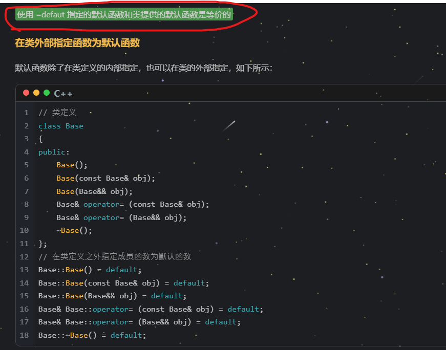
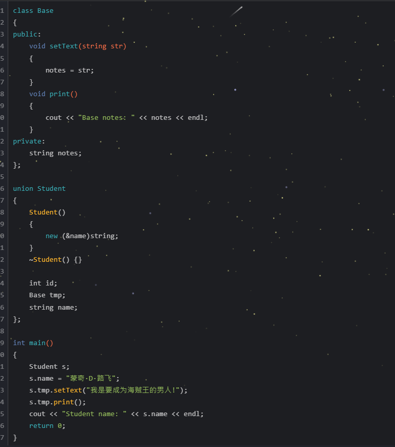

# 宏定义是一个很看重括号的东西 
宏定义 **定义是什么形式，则就替代什么形式**，别自己加括号！！！

#define  SQR(A)  A*A

则 SQR(y+z)= y+z*y+z 
千万别写成 (y+z)*(y+z)

只有 SQR((y+z)) --->  (y+z)*(y+z)


# 移动语义 但不移动任何东西 只是分享所有权

快 ！！ 资源重复利用 ！！


# forward 看模板   forward 模板类型为左值则转左值，为右值则转右值；当类型为 T 模板参数为右值则得到右值，为左值则为左值！


# 列表初始化  {}  
1、注意若构造函数本体，进行了初始化，则以构造函数内的初始化为准


$\color{red}{若下面这种情况，则初始化以构造函数内部初始化为准 a=10 b=20 无论a1和b2传入何值}$


2、静态成员变量不可使用列表进行初始化


# voliate  可以不让CPU对某语句进行优化
1、无用的for循环，编译器默认优化  但是 加上 voliate后，不优化
2、寄存器读值；一些变量，cpu存在寄存器中，然后快速读值（如全局变量），但是 voliate修饰后，每次去运行结果后读值 （如 多线程中，有一个全局变量flag，子线程睡眠2s后修改此值，但有可能主线程CPU将此变量存入寄存器，则主线程每次读取flag值，都是子线程改变之前的flag值）

# using 使用别名
1、可读性好


2、typedef直接不能定义含模板的别名

需要 额外定义一个类


using 可以直接定义模板别名


$\color{red}{注意 using 和 typedef 一样只是取别名，并不会创建新的变量类型}$


# 强制类型枚举


1、强制修饰关键字 class
2、指定底层元素的数据类型：char int （除 wchar_t 外的任何整型） 


# 模板类友元


# POD数据类型 

default  保留默认构造函数



无参构造重复定义


delete 禁止使用某某构造函数  禁止使用某某自定义函数


# 非受限联合

静态成员变量（需要在联合体外部声明或者初始化后才可使用） 静态成员函数 （只能调用静态成员变量）

在非受限联合体中静态成员变量和非静态成员变量使用的不是同一块内存。


1、t1.c 和 t1.age 用的内存就不同
2、int& tmp=age 错误 不可以使用引用类型


联合体中拥有，非 POD成员，且该成员拥有非平凡的构造函数，则联合体的默认构造函数将被编译器删除。 其他的特殊成员函数，例如默认拷贝构造函数、拷贝赋值操作符以及析构函数等，也将遵从此规则。下面来举例说明：


**定位放置 placement new**
一般：new 对象创建的地方，由系统随机在 堆上进行分配
定位 new：在已经分配的特定内存创建对象


指定new的位置 （使用定位放置new，我们可以反复动态申请同一块堆内存，避免内存的重复创建销毁（栈 内存会自动管理），从而提高程序的执行效率，比如说 网络通信中数据的接收和发送）


（nmuber和base的地址一样的原因：number是其布局中，第一个排版的元素）

自定义构造函数



在name内存处，进行数据的覆盖，以实现联合体
tmp的赋值：海贼王的男人，会覆盖掉s原来的name的值“路飞”；所以最后 打印name时，是要成为海贼王的男人

**匿名联合体**


$\color{red}{不同的类对象，拥有的信息，会有不同，但是 每个不同的类对象，只要拥有一个身份信息即可，所以只**存储一个**信息，所以用到了 联合体！！}$


但是 类对象中 只会有 union中一个成员，如果一个类对象，访问了不止一个 union对象，那么会报错，无结果（类的大小一开始就确定了，所以 只能放一个union对象！！！）

# 时钟  chrono库 
先记住一个 常用：
steady_clock  静态时钟  相当于秒表       std::chrono::steady_clock::now();


# 线程 
将 sleep 与 chrono 时间联合起来
```
#include <iostream>
#include <thread>
#include <chrono>
using namespace std;

void download1()
{
    // 模拟下载, 总共耗时500ms，阻塞线程500ms
    this_thread::sleep_for(chrono::milliseconds(500));
    cout << "子线程1: " << this_thread::get_id() << ", 找到历史正文...." << endl;
}

void download2()
{
    // 模拟下载, 总共耗时300ms，阻塞线程300ms
    this_thread::sleep_for(chrono::milliseconds(300));
    cout << "子线程2: " << this_thread::get_id() << ", 找到历史正文...." << endl;
}

void doSomething()
{
    cout << "集齐历史正文, 呼叫罗宾...." << endl;
    cout << "历史正文解析中...." << endl;
    cout << "起航，前往拉夫德尔...." << endl;
    cout << "找到OnePiece, 成为海贼王, 哈哈哈!!!" << endl;
    cout << "若干年后，草帽全员卒...." << endl;
    cout << "大海贼时代再次被开启...." << endl;
}

int main()
{
    thread t1(download1);
    thread t2(download2);
    // 阻塞主线程，等待所有子线程任务执行完毕再继续向下执行
    t1.join();
    t2.join();
    doSomething();
}
```

#### this_thread
detach 之后，子线程结束，不影响父线程和其它线程；但是 父线程结束后，所有子线程，包括detach出去的子线程也会一起结束！！但是，如果一个子线程，detach了，那么它将不再受主线程 get_id join等的控制影响


#### joinable 判断主线程和子线程是否有连接
join会实现阻塞，等待对应线程结束后，才继续往下执行，并在线程结束后，回收子线程资源


#### 静态函数  获取CPU核心数，创建 与之数量相等的线程，每个线程分配一个核心，此时 并发速率最高


#### sleep_for sleep_until  this_thread类接口
睡某一时间段     for
睡到某一时间点   until
如：
auto Now = chrono::steady_clock::now();
chrono::seconds sec(2);  // 类对象构造

this_thread::sleep_until(Now+sec);

#### yield() 函数 放弃到手的时间片，将线程变成 就绪态 （不排除 再次抢到时间片的情况！）
1、防止  一个线程执行时间过长，导致整体效率下降
2、主动放弃CPU后，还是会继续抢夺CPU执行权 
（变成了：  执行一会儿后，然后自动放弃，再去抢；抢到后，再执行一会儿后，再放弃，再抢！）

#### 保证某函数在多线程环境下只执行一次
需要 once_flag 作为call_once的传入参数； 
注意：只能是 通过 call_once的方式去调用函数，这样 多线程和一个线程中，函数只被调用一次
如下图：每个 Printfout函数 会打印5次输出
但是最后输出结果：共有10条输出结果：两次执行call_once，但只调用一次函数；Printfout不受此限制影响

