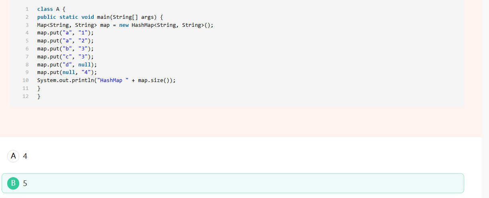
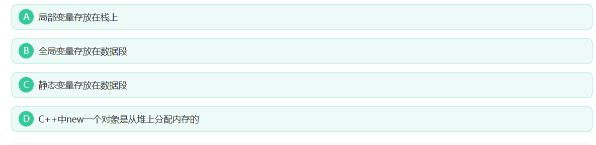
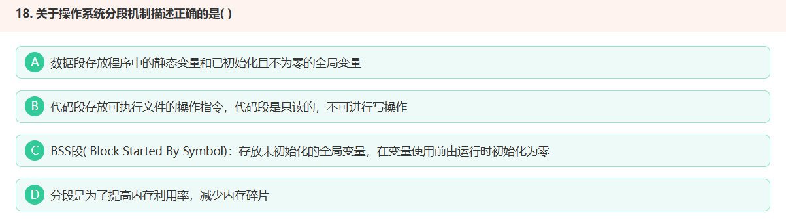
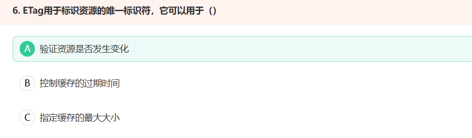
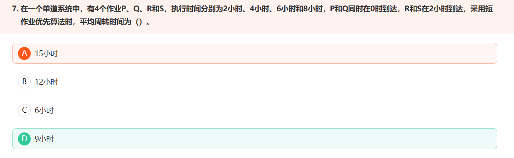
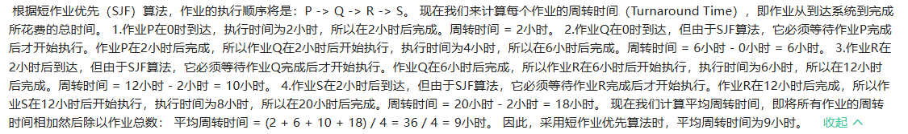
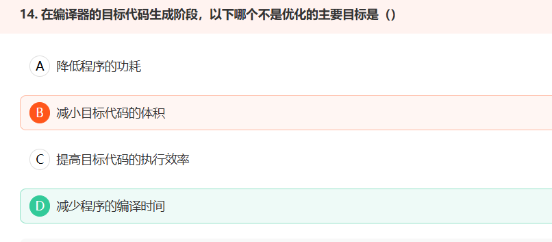
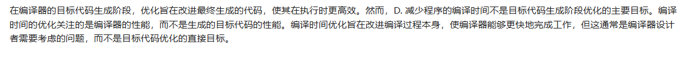
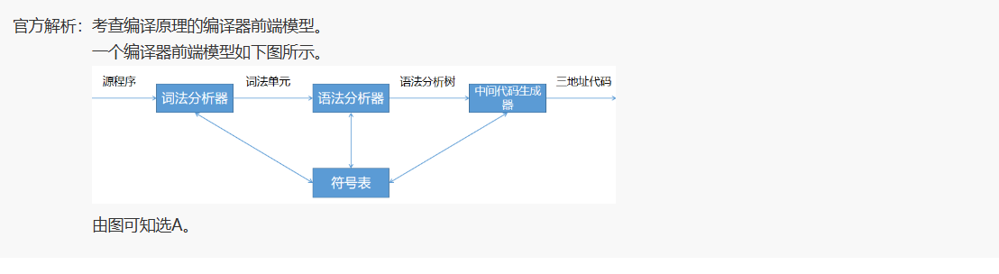
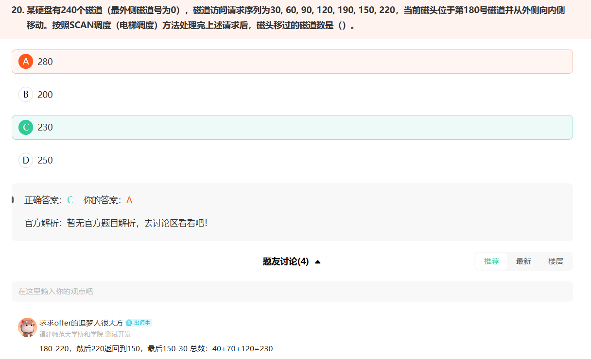

#  小米知识题
1、hashmap 插入时 key值是 覆盖填充

map中元素个数为 5；插入第二个a的时候，是把 第一个 a 的 vaule 由 1 变成 2

2、  macOS是基于unix的，它其实是unix的一条分支；而linux其实也是基于unix开发的，也是unix的一条分支，因此macos和linux其实都是基于unix的分支。因此，不能说macos是基于linux开发的。 
 
下面是基于linux开发的常见操作系统，用的较多的包括：红帽RedHat、CentOS、Ubuntu

3、不会触发进程调度：
 就绪状态 >>> 运行状态 (这个过程会出现任务调度) 
 
  A. 当任务完成之后，就会从从运行状态转换为就绪状态。 
 
  B.当进程访问临界区时，其他进程加锁，那么他就处于就绪状态,当其他程序释放所之后，他就会进入运行状态 
 
  C.当一个进程执行了一条转移指令后，这里我们举例：中断就是一个转移指令，当我们产生中断时程序会从运行状态变为阻塞状态，并不会引起任务调度 
 
  D.当我们创建一个新的进程时，新的进程处于就绪状态

4、c程序的存储空间

# 
1、

2、任务完成平均周转时间
单个任务所耗时间：等待时间+完成时间
平均：总共时间/任务个数

3、任务的响应比：  总时间/完成时间

4、

5、
