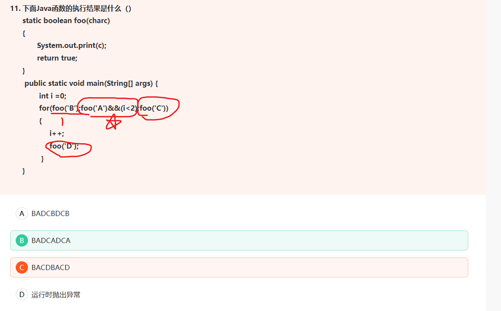
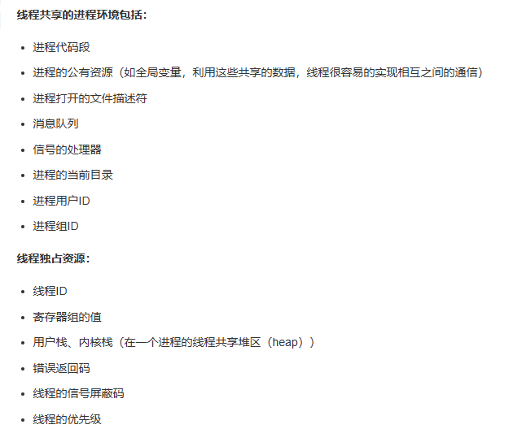
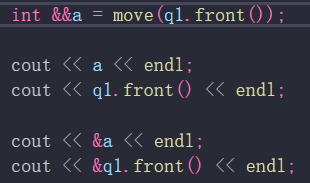
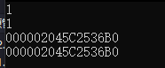
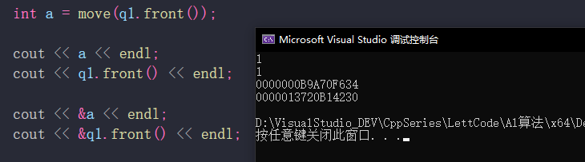
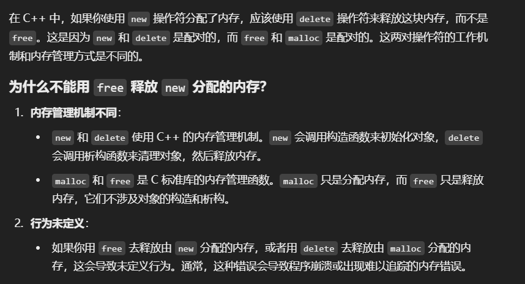
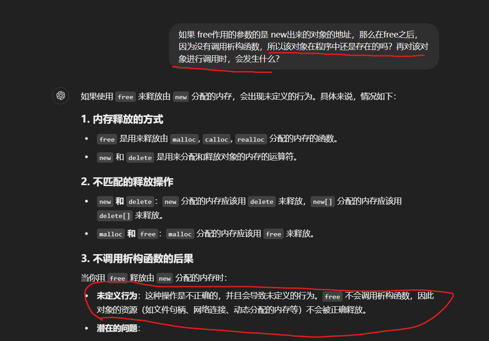
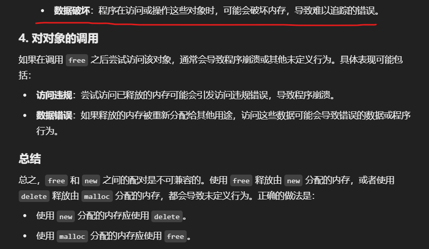

# 1、关于循环中代码的执行

条件初始变量只执行一次；
条件变量判断、条件变量变化、执行逻辑 三者循环执行；
且顺序是：条件变量判断；执行语句执行；条件变量变化。
最后一个执行的是 条件变量判断，然后跳出循环！！

# 2、线程间资源共享情况

# move移动给  右值引用  和 左值区别

a 和 front 是同一个元素

a是重新开辟的内存，然后复制了 front的值，创建的一个新对象

# new malloc   delete free

free作用后，再调用对象的话：

