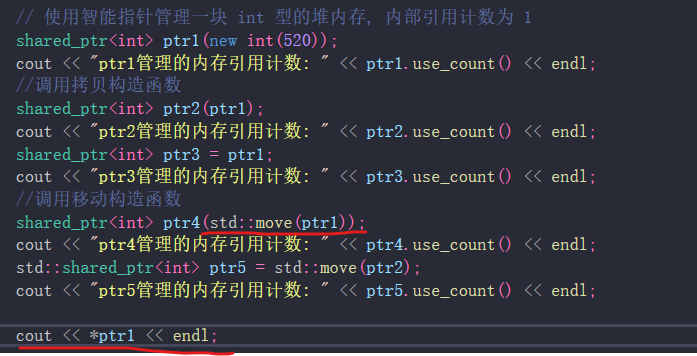
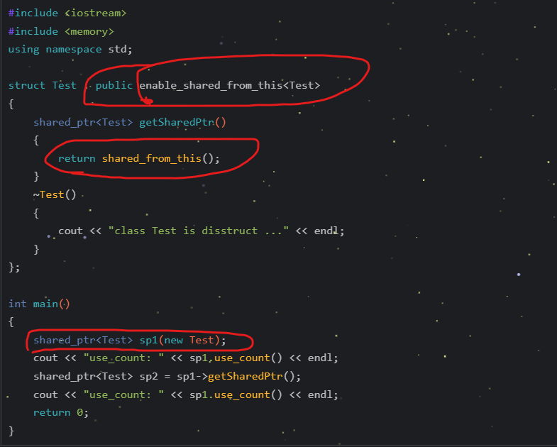

# const 表示常量  只读变量
const int a = 10;     // a 为常量
const int num;       // num是变量,但是只读

# struct 结构体的大小 受内存对齐的限制的影响；并且，结构体大小必须是 最大成员的内存大小的整数倍

大小都是 12

# 委托构造 /  子类继承父类的 构造函数   1、Child(): Father()      2、using Father::Father();

# 移动构造函数

这样 a被创造后，不会仅仅 构造出 对象后，就被析构了

# 类中 
const成员  声明时需要初始化

static成员变量 ：基本数据类型的，可以在类内初始化; 其它自定义类型的，需要在类外初始化

# POD  plain old data

# inline 内联函数 用于对编译器的建议
不再调用函数，而是直接把函数展开，（不会频繁开辟栈空间了）但是，只有 编译器认为 此函数较短适合展开时，才会这样去做！！

# 子类不可以继承 父类的友元关系
子类实现继承，是继承 父类某个对象  而 友元关系涉及到的函数 与父类对象其实没有多大关系

C++11 friend可以用作 模板类

# 联合体
受限联合体：
之前的 union  不能拥有 非POD 的数据  不能有静态成员  不能拥有引用类型的成员

非受限联合体：只要没有引用类型的成员即可

# 定位放置 new

可在 栈或堆上放置 对象  关键看 定位的内存地址 是处于栈上还是堆上。

# move

这里转让 指针之后，ptr1被销毁。（因为要保证 内存地址的引用次数 -1）

所以 cout *ptr1 崩溃

int num=3；
int b=move(num);
num可正常被操作 

相当于 普通的复制变量  而且 num后序改变是否影响 b，还看 b复制的是否是 a的内存

结果：5 3

结果：5 5

# shared_ptr
1、普通构造函数   2、make_shared  3、p.reset()  重新设置 管理的内存 

shared_ptr<int>p();     如果不分配管理的内存，则 count的结果为0

reset之后，原管理的内存 会被释放

**智能指针 要用来管理 堆上的数据内存**

# unique_ptr
1、 直接构造  2、不允许拷贝，复制 
3、但是允许  return unique_ptr ； unique_ptr2=move(unique_ptr1);  或者 reset（可以保证  count《1）

# weak_ptr  没有 -> * 重载，不能用来 对内存进行 什么特别的操作，只是用来 观察内存是否被引用的

count 引用计数  expired 是否被释放 

lock 获取对象

reset 不监测资源对象

return  shared\<class T>(this);  this 会被析构两次（被引用两次，但是只有一个对象呐）
所以，出错

所以可以用   shared_from_this() : weak_ptr 监听+ lock去返回 shared_ptr

# thread
t1.detach();
t1.joinable();
joinable()  线程是否被分离

hardware_concurrency()  获取 CPU核心数

call_once  函数只被调用一次（多线程里 只调用一次）

# this_thread

yield(); 让出CPU

# mutex

递归锁：进入递归后，把锁的使用给下次进入函数时的自己

lock_guard 里面的锁 可以多样

超时锁

# condition_variable  只接收  unique_lock 锁
condition_variable_any  可以接收 只要带有 lock unlock方法的任意锁

condition_variable(unique_lock)

condition_variable_any   1/wait()  2.wait(lock,pre) pre  “是否继续执行的判定” 谓词 ，返回true 则继续执行；false：阻塞

condition_variable_any 和 锁的生命周期绑定

# atomic

调用 atomic API方法时，会有内存顺序约束

release屏障 挡前面    acquire屏障  挡后面

# 线程异步：
future：getfuture  setfuture  wait  waitfor

promise 传入一个 promise值

packet_task 包装一个 异步函数;函数 的 返回值 可以是 future的 value

async通过返回值 是 future的方式，进程异步

# epoll 同步？
cfd=accept();
int n=epoll();

