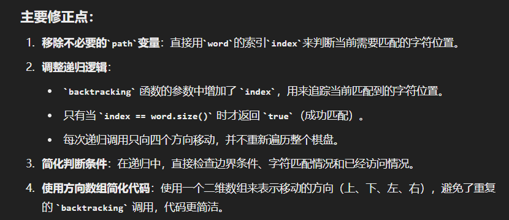

# 递归是在假设某一步要做的事
不要在某次 递归里做超出界限的事！！！：
```
给出一个二维字符数组和一个单词，判断单词是否在数组中出现，
单词由相邻单元格的字母连接而成，相邻单元指的是上下左右相邻。同一单元格的字母不能多次使用。
例如：
给出的字符数组=
[
  ["XYZE"],
  ["SFZS"],
  ["XDEE"]
]
单词 ="XYZZED", -> 返回 true,
单词 ="SEE", ->返回 true,
单词 ="XYZY", -> 返回 fXlse.
```

Wrong:
```
class Solution {
public:
    string path="";
    
    bool backtracking(vector<vector<char>>&board,string&word,vector<vector<int>>&used,int row,int col){
        if(row>=board.size()||col>=board[0].size()||row<0||col<0||used[row][col]==1){
            if(path==word){
                return true;
            }else{
                return false;
            }
        }
        if(path.size()>=word.size()){
            if(path==word){
                return true;
            }else{
                return false;
            }
        }


        for(int i=row;i<board.size();i++){
            for(int j=col;j<board[0].size();j++){
                path+=board[i][j];
                used[i][j]=1;
                if(backtracking(board, word, used, row+1,col))return true;
                if(backtracking(board, word, used, row,col+1))return true;
                if(backtracking(board, word, used, row-1,col))return true;
                if(backtracking(board, word, used, row,col-1))return true;
                path.pop_back();
                used[i][j]=0;
            }
        }

        return false;
    }

    bool exist(vector<vector<char> > &board, string word) {
        vector<vector<int>>used(board.size(),vector<int>(board[0].size(),0));
        return backtracking(board, word, used, 0, 0);   
    }
};
```

错误原因：每次 进入递归后 其实只能做 4件事：上下左右 遍历一块；但是 如果向上面那么写，每次进来后 都遍历一整块棋盘，这就错了

Correct:
```
class Solution {
public:
    // 定义方向数组，表示上下左右四个方向
    const vector<vector<int>> directions = {{0, 1}, {1, 0}, {0, -1}, {-1, 0}};

    bool backtracking(vector<vector<char>>& board, string& word, int index, int row, int col, vector<vector<int>>& used) {
        // 如果当前字符索引等于目标单词长度，说明成功匹配到单词
        if (index == word.size()) {
            return true;
        }
        // 如果越界或已访问或当前字符不匹配
        if (row < 0 || col < 0 || row >= board.size() || col >= board[0].size() || used[row][col] == 1 || board[row][col] != word[index]) {
            return false;
        }

        // 标记当前单元格为已使用   状态
        used[row][col] = 1;

        // 从当前单元格出发，尝试上下左右四个方向  此状态下做出的选择
        for (const auto& dir : directions) {
            int newRow = row + dir[0];
            int newCol = col + dir[1];
            if (backtracking(board, word, index + 1, newRow, newCol, used)) {
                return true;
            }
        }

        // 回溯，取消标记  状态还原
        used[row][col] = 0; 
        return false;
    }

    bool exist(vector<vector<char>>& board, string word) {
        if (board.empty() || board[0].empty()) {
            return false;
        }

        int rows = board.size();
        int cols = board[0].size();
        vector<vector<int>> used(rows, vector<int>(cols, 0)); // 创建一个与board相同大小的标记矩阵

        // 尝试从每个单元格作为起点开始搜索
        for (int i = 0; i < rows; i++) {
            for (int j = 0; j < cols; j++) {
                if (backtracking(board, word, 0, i, j, used)) {
                    return true; // 如果找到了，就返回true
                }
            }
        }
        return false; // 没有找到返回false
    }
};

```
