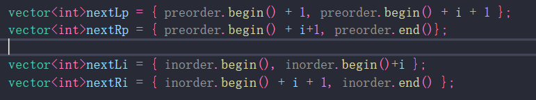
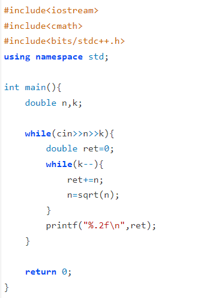

# 模拟题 
求平方根：sqrt(number)
一组二维坐标 练成线段；然后每次沿着线段可以走 x距离；到终点时截止；打印出中间经历的所有点，包括起点。但不包括终点

**模拟走路**   
// 把 next换成 target_start更好理解，表示目标target所在线段的起始端点
```
#include<iostream>
#include<bits/stdc++.h>
using namespace std;

int main(){
    int n,s;
    int index=0;
    double tempx,tempy;
    cin>>n;
    vector<double>Lx(n);
    vector<double>Ly(n);
    while(n--){
        cin>>tempx>>tempy;
        Lx[index]=tempx;
        Ly[index]=tempy;
        index++;
    }
    cin>>s;

    // 当前的坐标位置 
    double current_x=Lx[0],current_y=Ly[0];
    int Target=1;
    double target_x=Lx[Target],target_y=Ly[Target]; 
    double next_x,next_y; 
    double L=0;
    double L2=0;
    double step=s;                               // 在当前坐标可以向前走的距离
    printf("%.5f, %.5f\n",current_x,current_y);

    while(1){
        // 计算  下一目标点和当前坐标点之间的距离
        L2=(target_x-current_x)*(target_x-current_x)+(target_y-current_y)*(target_y-current_y);
        L=sqrt(L2);
        // 如果 L>step 说明 一步走不完当前线段，所以 走一步后的next坐标 还在当前线段上
        if(L>=step){
            next_x=current_x+(target_x-current_x)*(s/L);
            next_y=current_y+(target_y-current_y)*(s/L);
            current_x=next_x;
            current_y=next_y;
            printf("%.5f, %.5f\n",current_x,current_y);
            step=s;
        }else{
            // 越过了目标坐标，寻找下一个目标坐标
            if(Target>=Lx.size()-1)break;
            // step要做相应的减少，以表示越过了当前目标坐标
            step-=L;
            // next和target坐标是下一个线段的端点
            next_x=Lx[Target];
            next_y=Ly[Target];
            Target++;
            target_x=Lx[Target];
            target_y=Ly[Target];
            double between2=(target_x-next_x)*(target_x-next_x)+(target_y-next_y)*(target_y-next_y);
            double between=sqrt(between2);
            int flag=0;
            // 若step还是大于下一线段的长度，说明 这一步能路过好几个坐标点
            while(step>between){
                // 可能在里面的时候判断出到达终点了，所以要break
                if(Target>=Lx.size()-1){
                    flag=1;
                    break;
                }
                // step进行更新
                step-=between;
                next_x=Lx[Target];
                next_y=Ly[Target];
                Target++;
                target_x=Lx[Target];
                target_y=Ly[Target];
                between2=(target_x-next_x)*(target_x-next_x)+(target_y-next_y)*(target_y-next_y);
                between=sqrt(between2);
            }
            if(flag)break;
            // current更新，这时是以next为起始端点对current进行更新；每次current得到了更新，表示，走了一步，所以要打印一次
            current_x=next_x+(target_x-next_x)*(step/between);
            current_y=next_y+(target_y-next_y)*(step/between);
            printf("%.5f, %.5f\n",current_x,current_y);
            step=s;                    // step重新走下一步
        }
    }
    
    return 0;
}
```

# 模拟题2
构造树 中的 集合拆分


# 求平方根 sqrt 函数
