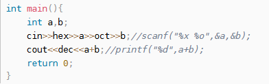
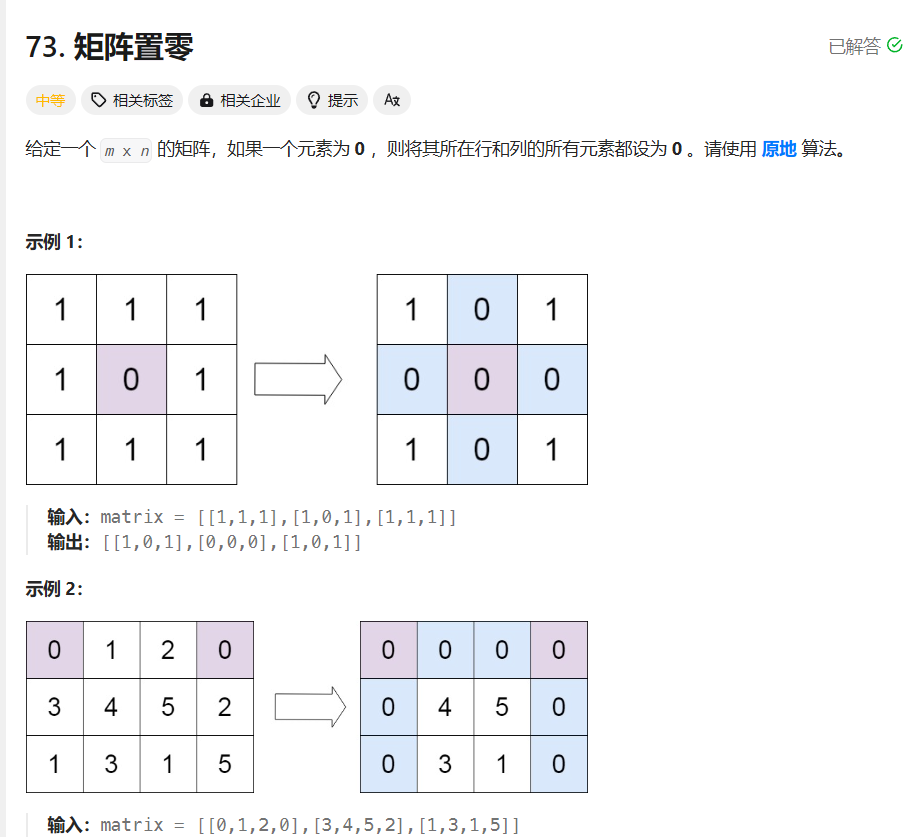

# 简单的  位或 位与
位或：1与0或为1；1与1或为1；0与0或为0；
位与：0与1/0与为0；1与1与为0；


# 偏移
1、<< 向左偏移 
    1、扩大 2^n倍
    2、1向左移位，然后进行位或/位与运算
    n=7;
    n&(1<<2);
    作用后 n=4;   n=0100

   偏移后，可做位+-运算
   n=0100;
   n+=(1<<3);        // n的第三位+1
   作用后 n=1000


# cin cout可以按照指定格式去接收输入;
cin>>hex>>num1; 
输入按照hex格式处理，然后转成num1

如： 输入 11.则num1=0x11=17；

输出同理：
cout<<hex<<num1;
num1=18；则输出为 12； 

# 注： 十进制 dec  十六进制 hex  八进制 oct
对应的c语言中 %x %o %d


# 用位图代替vector

```
class Solution {
public:
    void setZeroes(vector<vector<int>>& matrix) {
        // vector<int>flag_row(matrix.size(),0);
        // vector<int>flag_col(matrix[0].size(),0);
        // int flag_row=0;
        // int flag_col=0;
        string flag_row(matrix.size(),'0');
        string flag_col(matrix[0].size(),'0');

        for(int i=0;i<matrix.size();i++){
            for(int j=0;j<matrix[0].size();j++){
                if(matrix[i][j]==0){
                    flag_row[i]='1';
                    flag_col[j]='1';
                }
            }
        }

        for(int i=0;i<matrix.size();i++){
            for(int j=0;j<matrix[0].size();j++){
                if(flag_row[i]=='1'||flag_col[j]=='1'){
                    matrix[i][j]=0;
                }
            }
        }

        return;
    }
};
```

用位运算 去做 row|col 的相关标记：
```
class Solution {
public:
    void setZeroes(vector<vector<int>>& matrix) {
        // vector<int>flag_row(matrix.size(),0);
        // vector<int>flag_col(matrix[0].size(),0);
        int flag_row=0;
        int flag_col=0;

        for(int i=0;i<matrix.size();i++){
            for(int j=0;j<matrix[0].size();j++){
                if(matrix[i][j]==0){
                    // flag_row[i]=1;
                    // flag_col[j]=1;
                    flag_row|=1<<i;
                    flag_col|=1<<j;
                }
            }
        }

        for(int i=0;i<matrix.size();i++){
            for(int j=0;j<matrix[0].size();j++){
                if((flag_row&(1<<i))||(flag_col&(1<<j))){
                    matrix[i][j]=0;
                }
            }
        }

        return;
    }
};
```
