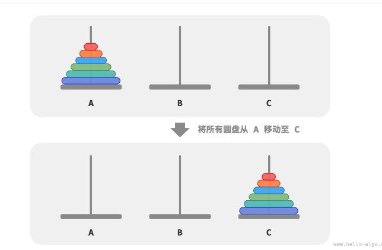
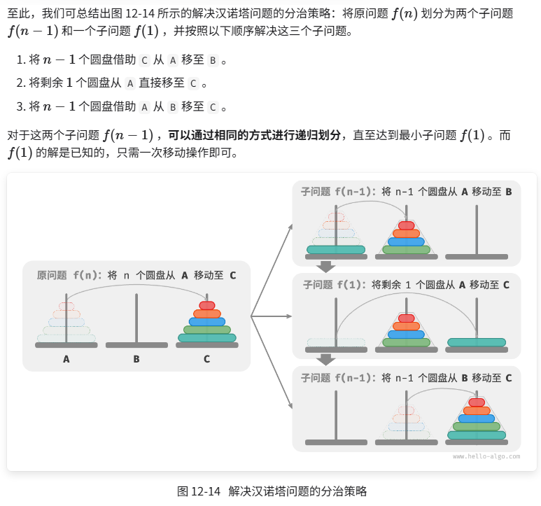

# 错综复杂的大问题，我不断地去划分再划分

汉诺塔：n个圆盘移动只分为  n-1 和 1个圆盘的移动 
但是对于  n-1  和   1 来说，src buf 不同  虽然 tar相同
src：初始柱子    buf：缓冲柱子   tar：目标柱子

```
void move(stack<int>& src, stack<int>& tar) {
	int temp = src.top();
	src.pop();
	tar.push(temp);
}

void dfs(int i,stack<int>& src, stack<int>& buf, stack<int>& tar) {
	if (i == 1) {
		move(src, tar);
		return;
	}

	dfs(i - 1, src, tar, buf);
	move(src, tar);
	dfs(i - 1, buf, src, tar);

	return;
}
```

