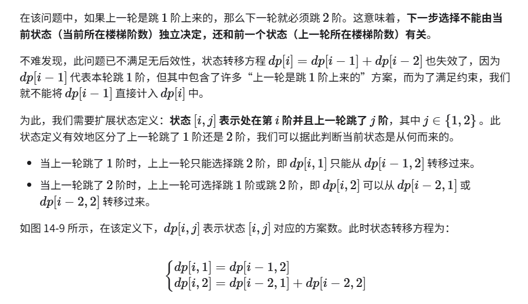
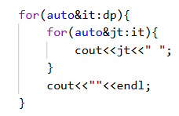
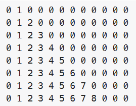

# 记忆化搜索
会出现重复计算 某 dp[i] 的时候，不如把 dp[i]直接放在某 mem数组中，然后后序再次计算 dp[i]的时候，直接使用 mem[i]

/* 记忆化搜索 */
```
int dfs(int i, vector<int> &mem) {
    // 已知 dp[1] 和 dp[2] ，返回之
    if (i == 1 || i == 2)
        return i;
    // 若存在记录 dp[i] ，则直接返回之
    if (mem[i] != -1)
        return mem[i];
    // dp[i] = dp[i-1] + dp[i-2]
    int count = dfs(i - 1, mem) + dfs(i - 2, mem);
    // 记录 dp[i]
    mem[i] = count;
    return count;
}

/* 爬楼梯：记忆化搜索 */
int climbingStairsDFSMem(int n) {
    // mem[i] 记录爬到第 i 阶的方案总数，-1 代表无记录
    vector<int> mem(n + 1, -1);
    return dfs(n, mem);
}
```

# 无后效性
14.2.2   无后效性¶
无后效性是动态规划能够有效解决问题的重要特性之一，其定义为：给定一个确定的状态，它的未来发展只与当前状态有关，而与过去经历的所有状态无关。

以爬楼梯问题为例，给定状态i，它会发展出状态 i+1 和状态 i+2，分别对应 跳 1步和跳 2步。在做出这两种选择时，我们无须考虑状态 i 之前的状态，它们对状态 i 的未来没有影响。

然而，如果我们给爬楼梯问题添加一个约束，情况就不一样了。

带约束爬楼梯：

给定一个共有 n阶的楼梯，你每步可以上 1阶或者 2阶，但不能连续两轮跳 1阶，请问有多少种方案可以爬到楼顶？

此时 表需要变成2维的了 状态转移方程有两种情况：



# 打表检查
```
class Solution {
public:
    int minSubArrayLen(int target, vector<int>& nums)
    {
        vector<vector<int>>dp(nums.size(),vector<int>(target+1,0));
        
        if(nums[0]<=target)dp[0][nums[0]]=1;
        for(int i=1;i<nums.size();i++){
            for(int j=0;j<nums[i];j++)dp[i][j]=dp[i-1][j];
            if(nums[i]<=target)dp[i][nums[i]]=1;
            for(int j=nums[i]+1;j<=target;j++){
                if(dp[i-1][j]==0){
                    if(dp[i-1][j-nums[i]]!=0)dp[i][j]=dp[i-1][j-nums[i]]+1;
                }else{
                    dp[i][j]=min(dp[i-1][j],dp[i-1][j-nums[i]]+1);
                }
            }
        }

        for(auto&it:dp){
            for(auto&jt:it){
                cout<<jt<<" ";
            }
            cout<<""<<endl;
        }

        return dp[nums.size()-1][target];
    }
};
```

