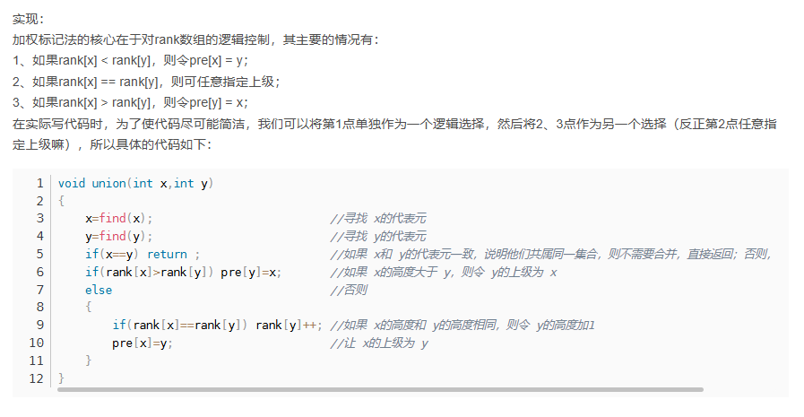

# 每个集合选出一个 代表元

### find 函数
find(x) 作用：用于查找某个人所在门派的教主（代表元），换言之，就是对于某个x，返回其所属集合的代表

int Pre[1000] （长度依据题意）,数组记录了 每个人的上级是谁，编号从 0或者1 开始（依据题意而定） 如：pre[16]=6  16的上级是6号     pre[11]=11, 上级是自己，则是代表元

```
int find(int x){
    while(pre[x]!=x){
        x=pre[x];
    }

    return x;
}
```

### join 函数
已经存在的不同门派之间，进行合并 （如 A B门派，把 A 的代表元的上级 从其自身，改成 B的代表元  即 原来  pre[A_1]=A_1  变成  pre[A_1]=B_1）
实现：
```
void join(int x,int y){
    int X_boss=find[x];
    int Y_boss=find[y];
    if(X_boss!=Y_boss){
        pre[X_boss]=Y_boss;       // 这里 让哪个门派归属于哪个门派，其实没有具体的要求或原则  1、一看题目是否有限制  2、二是自己随意
    }
}
```


##  优化
### 前面的 join 归并时，带来的影响不确定，有时可能导致 整个队伍变成一个 链表，查找起来 就比较慢了


#### 路径压缩 1
find的时候  找到代表元后 压缩路径


需要用到**递归**，先 **递** 遍历每个子节点，然后 把最后找到的 代表元 结果，进行 **归**
int find(int x){
    if(pre[x]==x)return x;
    return pre[x]=find[pre[x]]; //此代码相当于先找到根结点 rootx，然后pre[x]=rootx 
    //或者  先赋值再 return 结果
    //pre[x]=find[pre[x]];
    //return pre[x];      
}
该算法存在一个缺陷：只有当查找了某个节点的代表元（教主）后，才能对该查找路径上的各节点进行路径压缩。换言之，第一次执行查找操作的时候是实现没有压缩效果的，只有在之后才有效。

#### 路径压缩 2
加权标记
每个节点存在 rank 值表示，以自己为根的树的高度，然后 在合并的时候，选择让 rank 大的节点，成为 代表元，即 A_boss B_boss 要进行合并，若 rank[A_boss] > rank[B_boss] 则 pre[B_boss]=A_boss ，否则 pre[A_boss]=B_boss


只有在 rank 相等时才++变化 因为 在不等时 差值至少为1  而挂在另一方时，此处分支只是增加1个高度，所以最多是和 另一方最高分支持平而以，所以对 根节点的高度没有影响


并查集 完整代码：
```
#define Set_size 1005
int pre[Set_size];
int rank[Set_size];

// 初始化函数  记录n个节点
void init(int n){
    for(int i=0;i<n;i++){
        pre[i]=i;
        rank[i]=1;
    }
}

int find(int x){
    ## 方法1
    while(pre[x]!=x){
        x=pre[x];
    }

    return x;

    ## 方法2
    if(x==pre[x])return x;
    return find(pre[x]);
}

// 带压缩路径的 find 改进
int find(int x){
    if(x==pre[x])return x;
    return pre[x]=find(pre[x]);
}

bool issame(int x,int y){
    x=find(x);
    y=find(y);

    return x==y;

    或者直接:
    
    return find(x)==find(y);
}

bool join(int x,int y){
    x=find(x);
    y=find(y);
    if(x==y)return false;
    if(rank[x]>rank[y]){
        pre[y]=x;
    }else{
        pre[x]=y;
        if(rank[y]==rank[x]){
            rank[y]++;
        }
    }

    return true;
}
```

趁热打铁：


init 就是先对 花园进行初始化 
然后 后序每一对输入 都是 join，然后最后 find，看 find 出来的 值 有多少个不同的 代表元，则表示有多少株连根植物


不用 set 也行。通过 一个简易的 hash表 根节点上赋值 1


趁热打铁2：
面试题1
小汪作为一个有数学天分的程序猿，设计了一套密码生成器来搞定自己的密码问题。
密码生成器由 N 个槽位组成，槽位的下标为 0~N-1 ，每个槽位存储一个数。起初每个槽位都是 0 。
密码生成器会进行 M 轮计算，每轮计算，小汪会输入两个数 L , R (L<=R),密码生成器会将这两个数作为下标，将两个下标之间（包含）的所有槽位赋值为 i（ i 为当前的轮次， i ∈ [1,M]）。
M轮计算完成后，密码生成器会根据槽位的最终值生成一条密码，密码的生成规则为：
（0*a[0] + 1*a[1] + 2*a[2] + ... + (N-1)*a[N-1]) mod 100000009
其中a[i]表示第i个槽位的最终值。
请帮助小汪把他的密码生成器实现为代码。

解题思路
问题描述：密码生成器有 N 个槽位，每个槽位初始值为 0。每轮操作将给定范围 [L, R] 内的所有槽位赋值为当前轮次 i，共进行 M 轮操作。最终根据所有槽位的值生成一个密码。

差分数组和并查集：为了高效地处理多次区间更新操作，我们使用差分数组的思想与并查集相结合。通过并查集，我们可以有效地找到当前需要更新的槽位，并进行路径压缩来加速查询。

反向处理操作：通过反向遍历的方式，将每一轮的操作逐步应用到数组中，可以避免重复赋值的问题，并且确保每个槽位的值最终为最近一次操作的轮次编号。

在并查集中，“根节点”是指每个集合的代表元素或根元素。在你的问题中，“槽位的根节点”其实是用来表示一个特定位置是否已经被更新过，并用于高效地管理这些槽位的更新状态。

查找操作 find(x)：

find(x) 的作用是找到槽位 x 所在集合的根节点，即当前未被更新的最左边的槽位。
例如，假设我们要更新区间 [L, R]，我们从左到右依次查找更新。当我们调用 find(L) 时，找到的是 L 的根节点，即还未被更新的槽位。
根节点的用途：

如果 fa[x] != x，表示槽位 x 已经被更新过了，它的父节点（fa[x]）指向下一个未被更新的槽位。
当我们找到某个槽位 x 并更新它后，我们将它的根节点 fa[x] 指向下一个槽位 x + 1，相当于“删除”当前槽位，表示它已经被处理过了，不需要再次处理。
例子说明
假设有 N = 5 个槽位（编号为 0 到 4），M = 3 轮操作，操作如下：

第 1 轮：更新区间 [1, 3]，所有槽位 1 到 3 赋值为 1。
第 2 轮：更新区间 [0, 2]，所有槽位 0 到 2 赋值为 2。
第 3 轮：更新区间 [2, 4]，所有槽位 2 到 4 赋值为 3。
我们使用反向遍历的方式，从最后一轮（第 3 轮）操作开始，依次向前处理。

第 3 轮操作 [2, 4]：

先查找 find(2)，找到根节点 2，更新 w[2] = 3，然后 fa[2] = 3。
查找 find(3)，找到根节点 3，更新 w[3] = 3，然后 fa[3] = 4。
查找 find(4)，找到根节点 4，更新 w[4] = 3，然后 fa[4] = 5（超出范围表示已处理完）。
第 2 轮操作 [0, 2]：

查找 find(0)，找到根节点 0，更新 w[0] = 2，然后 fa[0] = 1。
查找 find(1)，找到根节点 1，更新 w[1] = 2，然后 fa[1] = 2。
查找 find(2)，当前 fa[2] 指向 3（第 3 轮已更新），所以跳过。
第 1 轮操作 [1, 3]：

查找 find(1)，当前 fa[1] 指向 2，继续查找。
查找 find(2)，当前 fa[2] 指向 3，继续查找。
查找 find(3)，当前 fa[3] 指向 4，所以跳过。
总结
根节点 用来表示每个槽位的代表元素，当槽位被更新过后，根节点指向下一个需要更新的位置。
通过路径压缩，我们将不必要的查找操作减少到最小，从而提高整体性能。
这种方法使得更新操作的复杂度接近 O(1)，从而高效解决大规模的多次区间更新问题。

并且 我们后序用 压缩路径算法，后面find 是可以**一次操作**就直接找到其 门派的教主的！ 如find(2)后面直接找到4


#### 并查集：可以打通一个范围 [L R]

此处用 $\color{red}{并查集是为了，在逆序遍历轮次操作时，让前面的轮次中再出现“已经操作过的范围时”，直接跳过去}$：我们已 每个已经操作过的范围的右界 R为 代表元，所以 当 While(find(Pre[L]<=R)) 进行范围判断时，find会直接找到已经操作过的范围的 右界 R，所以这些很多无用的重复判断就不用再去做了，性能提高很多

```
#include<iostream>
#include<bits/stdc++.h>
using namespace std;

const int MOD = 100000009;
const int N = 2e7 + 10; // 根据题目限制定义数组大小


int w[N];

vector<pair<int, int>>v1;

int main() {
    int n, m;
    cin >> n >> m;
   
    fill(w, w + n + 1, 0); // 初始化最终值数组为0
    int L, R;
    while (m--) {
        cin >> L >> R;
        v1.push_back(make_pair(L, R));
    }

    for (int i = v1.size(); i >= 1; i--) {
        L = v1[i-1].first;
        R = v1[i-1].second;
        // 如果是这样做，那么会做很多无用的循环 前面轮次的 L R还会再次做判断，会走完全程 while(L<=R)   
        while (L <= R) {
            if (w[L] == 0) {
                w[L] = i;
            }
            L++;
        }
    }

    long long password = 0;
    for (int i = 0; i < n; i++) {
        password = (password + (1LL * i * w[i]) % MOD) % MOD;
    }

    cout << password << endl;
    return 0;

}
```
并查集 可以用来判断  1、之间是否有集合关系  2、可以联通（pre[x]=y  就把 x和y联通起来了，下面就是 通过 pre[L]=L+1 然后一步步把 [L R] 整个范围联通在一起！！！）3、然后判断是否联通 issame(x,y)  4、如果有考虑压缩路径，则直接能找到 代表元  

```
#include<iostream>
#include<bits/stdc++.h>
using namespace std;

const int MOD = 100000009;
const int N = 2e7 + 10; // 根据题目限制定义数组大小

int pre[N];
int w[N];

int Find(int x) {
    if (x != pre[x])pre[x] = Find(pre[x]);
    return pre[x];
}

vector<pair<int, int>>v1;

int main() {
    int n, m;
    cin >> n >> m;

    // 初始化并查集
    for (int i = 0; i <= n; i++) pre[i] = i; // 每个槽位初始化为自己
    fill(w, w + n + 1, 0); // 初始化最终值数组为0
    int L, R;
    while (m--) {
        cin >> L >> R;
        v1.push_back(make_pair(L, R));
    }

    for (int i = v1.size(); i >= 1; i--) {
        L = v1[i-1].first;
        R = v1[i-1].second;
        /// L后面会和R 联通起来，[L,R] 成为一个集合，所以到了 L之后会立马跳出 之前已经操作过的范围的最右边R，所以不会再这之间做很多重复的操作！！！  YYDS  
        while (Find(L) <= R) {
            if (Find(L) == L) {
                w[L] = i;
                pre[L] = L + 1;
            }
            L = pre[L];
        }
    }

    long long password = 0;
    for (int i = 0; i < n; i++) {
        password = (password + (1LL * i * w[i]) % MOD) % MOD;
    }

    cout << password << endl;
    return 0;

}
```

```
void Merge(vector<int>&nums,int L,int mid,int R){
    int Size=R-L+1;

    vector<int>temp(Size);
    int i=L,j=mid+1;
    int index=0;

    while(i<=mid&&j<=R){
        if(nums[i]>nums[j]){
            temp[index++]=nums[j++];
        }else{
            temp[index++]=nums[i++];
        }
    }

    while(i<=mid){
        temp[index++]=nums[i++];
    }

    while(j<=R){
        temp[index++]=nums[j++];
    }

    for(int k=0;k<=temp.size();k++){
        nums[L+K]=temp[k];
    }
}

void SplitAndSort(vector<int>&nums,int L,int R){
    if(L>=R)
        return;
    int mid=L+(R-L)/2;
    SplitAndSort(nums,L,mid);
    SplitAndSort(nums,mid+1,R);

    Merge(nums,L,mid,R);
}

```

# 并查集 找节点权值均不相同的路径
并查集+尾部遍历

