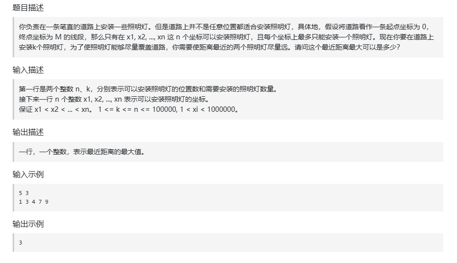
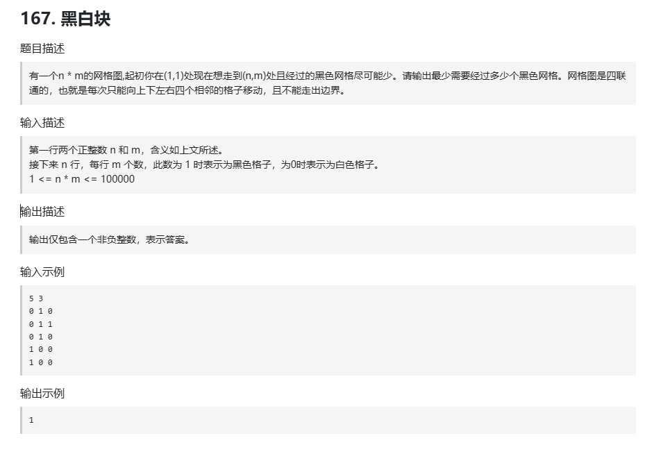
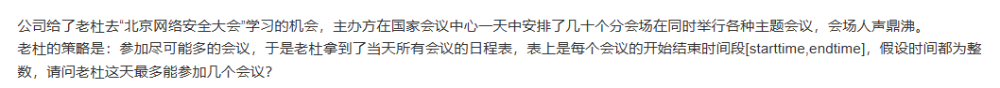

# 安装路灯  
不一定要从问题设定的起点出发。



不一定就得说，设置k个路灯。然后看最大距离是多少。

我们可以 假设某个可能的距离，然后，再看是否可以安装k个路灯，最后看假设的距离中，哪个符合条件：**最大距离，且能安装k个路灯**

```
#include<iostream>
#include<bits/stdc++.h>
using namespace std;

bool isok(vector<int>&nums,int k,int distance){
    int count=1;
    int pre=0;
    for(int i=1;i<nums.size();i++){
        if(nums[i]-nums[pre]>=distance){
            count++;
            pre=i;
        }
    }
    
    if(count>=k){
        return true;
    }
    
    return false;
}

int main(){
    int n,k;
    cin>>n>>k;
    
    vector<int>nums(n);
    
    int m=INT_MAX;
    for(int i=0;i<n;i++){
        cin>>nums[i];
    }
    
    sort(nums.begin(),nums.end());
    
    int L=1;
    int R=nums[n-1]-nums[0];
    int ret=INT_MIN;
    
    int mid;
    while(L<=R){
        mid=L+(R-L)/2;
        if(isok(nums,k,mid)){
            ret=max(mid,ret);
            L=mid+1;
        }else{
            R=mid-1;
        }
        
    }
    
   
    cout<<ret<<endl;
    
    return 0;
}
```

# 黑白块

1、回溯 根据  “状态”---“选择、修改状态”---"回溯状态"的原则，写下回溯，但是 超时了
```
#include<iostream>
#include<bits/stdc++.h>
using namespace std;


int temp;
int ret=INT_MAX;

void backtracking(vector<vector<int>>&Map,int Start,int End,vector<vector<int>>&used){
    if(Start<0||End<0||Start>=Map.size()||End>=Map[0].size()){
        // cout<<"||||"<<endl;
        return;
    }
    
    if(used[Start][End])return;
    if(Map[Start][End]==1){
        temp+=1;
    }
    used[Start][End]=1;
    // cout<<"I am at the("<<Start<<":"<<End<<")-";
    if(Start==Map.size()-1&&End==Map[0].size()-1){
        ret=min(ret,temp);
        used[Start][End]=0;
        // cout<<"OKOK"<<endl;
        return;
    }
    
    backtracking(Map,Start+1,End,used);
    backtracking(Map,Start-1,End,used);
    backtracking(Map,Start,End+1,used);
    backtracking(Map,Start,End-1,used);
    
    if(Map[Start][End]==1)temp-=1;
    used[Start][End]=0;
    
    return;
}

int main(){
    int n,m;
    cin>>n>>m;
    
    vector<vector<int>>Map(n,vector<int>(m));
    for(int i=0;i<n;i++){
        for(int j=0;j<m;j++){
            cin>>Map[i][j];
        }
    }
    
    // vector<vector<int>>dp(n,vector<int>(m));
    // for(auto&it:Map){
    //     for(auto&ji:it){
    //         cout<<ji<<" ";
    //     }
    //     cout<<endl;
    // }
    
    temp=0;
    vector<vector<int>>used(n,vector<int>(m,0));
    backtracking(Map,0,0,used);
    
    cout<<ret<<endl;
    
    // cout<<"It is ok"<<endl;
    
    return 0;
}
```

其它做法：本质是一个 图论问
题，日后讨论，现在先找到工作


# 与会的时间

按结束时间的早晚进行排序，然后遍历数组，把所有能参加的会都算上

输入 [8,9],[9,10],[11,13],[10,15],[17,18]...

```
int main() {
	vector<pair<int, int>>nums;
	string str;
	cin >> str;
	string num1;
	string num2;
	int n1, n2;
	int flag = 1;
	for (int i = 0; i < str.size(); i++) {
		if (str[i] >= '0' && str[i] <= '9') {
			if (flag) {
				num1 += str[i];
			}
			else {
				num2 += str[i];
			}
		}
		else if (str[i] == ',' && num1.size() != 0) {
			n1 = stoi(num1);
			num1 = "";
			flag = 0;
		}
		else if (str[i] == ']' && num2.size() != 0) {
			n2 = stoi(num2);
			num2 = "";
			flag = 1;
			nums.push_back(make_pair(n1, n2));
		}
	}

	sort(nums.begin(), nums.end(), [](pair<int, int>& p1, pair<int, int>& p2) {
		if (p1.second != p2.second) {
			return p1.second < p2.second;
		}
		else {
			return p1.first < p2.first;
		}
		});

	int End = 0, ret = 0;
	for (int i = 0; i < nums.size(); i++) {
		if (nums[i].first >= End) {
			ret++;
			End = nums[i].second;
		}
	}

	cout << ret << endl;

	return 0;
}
```