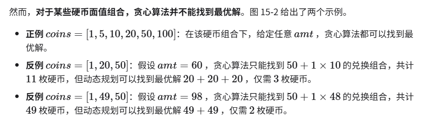
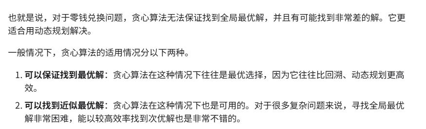
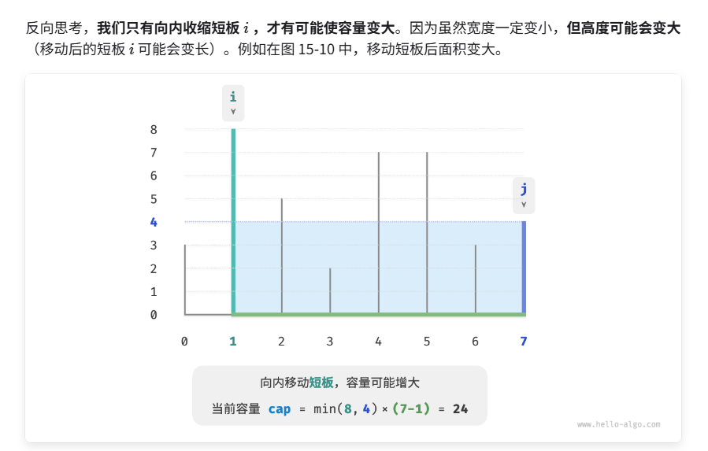
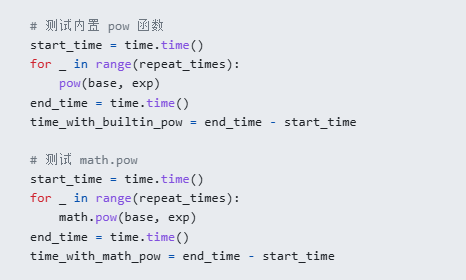

# 贪心算法 
贪心和动规都试图从 子结构 到 整体结构 去解决问题
但是：
贪心：每一步做出的选择，依据 某贪心规则，依据此规则，每一步都能选出一个最优化操作
动规：依据 状态转移方程 （某个最优规则，到了下个状态可能就不符合了）

而且：
贪心算法和动态规划都常用于解决优化问题。它们之间存在一些相似之处，比如都依赖最优子结构性质，但工作原理不同。

动态规划会根据之前阶段的所有决策来考虑当前决策，并使用过去子问题的解来构建当前子问题的解。
贪心算法不会考虑过去的决策，而是一路向前地进行贪心选择，不断缩小问题范围，直至问题被解决。

并且，最主要的是：局部最优，有时不一定是全局最优！！！所以贪心算法并不是万能的     找不到反例时，试试贪心吧！！

如：

也就是 第一步贪心 其实是仅仅站在 第一步状态上考虑的，或者当前仅有的可选范围内考虑的，而并非 全局最优


相较于动态规划，贪心算法的使用条件更加苛刻，其主要关注问题的两个性质。

贪心选择性质：只有当局部最优选择始终可以导致全局最优解时，贪心算法才能保证得到最优解。
最优子结构：原问题的最优解包含子问题的最优解。

例题  Example

挡板的最大容量：
贪心思路：对于 当前的 [L,R] 来说，往最高挡板靠近，才有可能会长大


```
int maxCapacity(vector<int> &ht) {
    // 初始化 i, j，使其分列数组两端
    int i = 0, j = ht.size() - 1;
    // 初始最大容量为 0
    int res = 0;
    // 循环贪心选择，直至两板相遇
    while (i < j) {
        // 更新最大容量
        int cap = min(ht[i], ht[j]) * (j - i);
        res = max(res, cap);
        // 向内移动短板
        if (ht[i] < ht[j]) {
            i++;
        } else {
            j--;
        }
    }
    return res;
}
```


例题2 拆整数   
贪心： 拆成 4 和 3时最大


注意： math.pow 方法 求 幂乘的复杂度是  O(1)  而  pow 是 O(logn)
