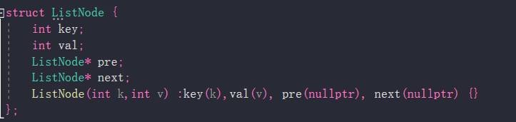

#  map+map
// 但是 put不是 O(1)的
(**除非你能做到，让time 的map，按value进行排序！！，这样usetime的开头就是一直未使用的节点，然后useTime.earse 和 kvStore.erase**，但是，可惜的是，map构造时只能按照key进行排序)
```
class LRUCache {
public:
    LRUCache(int capacity) {
        kvStore_capacity=capacity;
        kvStore_size=0;
        maxtime=0;
    }
    
    int get(int key) {
        if(kvStore.find(key)!=kvStore.end()){
            int Va=kvStore[key];
            useTime[key]=(++maxtime);
            return Va;
        }else{
            return -1;
        }
    }
    
    void put(int key, int value) {
        if(kvStore.find(key)==kvStore.end()){
            if(kvStore_size>=kvStore_capacity){
                int oldTime=INT_MAX,oldKey;
                for(auto&it:useTime){
                    if((it.second<oldTime)){
                        oldTime=it.second;
                        oldKey=it.first;
                    }
                }
                kvStore.erase(oldKey);
                useTime.erase(oldKey);
                kvStore[key]=value;
                useTime[key]=(++maxtime);
            }else{
                kvStore[key]=value;
                useTime[key]=(++maxtime);
                kvStore_size++;
            }
        }else{
            kvStore[key]=value;
            useTime[key]=(++maxtime);
        }
    }
   
private:
    map<int,int>kvStore;
    map<int,int>useTime;
    int kvStore_capacity;
    int kvStore_size;
    int maxtime;
};
```


# map+双向链表

LRU 缓存机制可以通过哈希表辅以双向链表实现，我们用一个哈希表和一个双向链表维护所有在缓存中的键值对。

**注意 链表中的 “value”是 要存储的键值对 “key+value” **


双向链表按照被使用的顺序存储了这些键值对，靠近头部的键值对是最近使用的，而靠近尾部的键值对是最久未使用的。

哈希表即为普通的哈希映射（HashMap），通过缓存数据的键映射到其在双向链表中的位置。

这样以来，我们首先使用哈希表进行定位，找出缓存项在双向链表中的位置，随后将其移动到双向链表的头部，即可在 O(1) 的时间内完成 get 或者 put 操作。具体的方法如下：

对于 get 操作，首先判断 key 是否存在：

如果 key 不存在，则返回 −1；

如果 key 存在，则 key 对应的节点是最近被使用的节点。通过哈希表定位到该节点在双向链表中的位置，并将其移动到双向链表的头部，最后返回该节点的值。

对于 put 操作，首先判断 key 是否存在：$\color{red}{**对于put操作而言，一定要把key-value压入数据结构中**}$

如果 key 不存在，使用 key 和 value 创建一个新的节点，在双向链表的头部添加该节点，并将 key 和该节点添加进哈希表中。然后判断双向链表的节点数是否超出容量，如果超出容量，则删除双向链表的尾部节点，并删除哈希表中对应的项；

如果 key 存在，则与 get 操作类似，先通过哈希表定位，再将对应的节点的值更新为 value，并将该节点移到双向链表的头部。

上述各项操作中，访问哈希表的时间复杂度为 O(1)，在双向链表的头部添加节点、在双向链表的尾部删除节点的复杂度也为 O(1)。而将一个节点移到双向链表的头部，可以分成「删除该节点」和「在双向链表的头部添加节点」两步操作，都可以在 O(1) 时间内完成。

小贴士

在双向链表的实现中，使用一个伪头部（dummy head）和伪尾部（dummy tail）标记界限，这样在添加节点和删除节点的时候就不需要检查相邻的节点是否存在。
map：查找是 O(1)的； 
Listnode: 增删是O(1)的（如果已经知道要删除的链表是谁 1、删除尾部，则直接删，并可以返回给map，让map去erase(node)  2、删除 map[key]的链表，则 map[key]=node，直接 remove(node)即可 O(1)复杂度）

```
// 双向链表的尾部是最久未用的节点；双向链表的开头是最新的节点。
// cache 里放的是 int key和 DLinkedNode* node(key 和 node的key一致，所以可以用来进行索引)

cacahe 用来O(1)查找；DLinkedNode用来维护

struct DLinkedNode{
    int key,value;
    DLinkedNode* pre;
    DLinkedNode* next;
    DLinkedNode():key(0),value(0),pre(nullptr),next(nullptr){}
    DLinkedNode(int k,int v):key(k),value(v),pre(nullptr),next(nullptr){}
};

class LRUCache {
public:
    LRUCache(int capacity) {
        cacheCapacity=capacity;
        cacheSize=0;
        head=new DLinkedNode();
        tail=new DLinkedNode();
        head->next=tail;
        tail->pre=head;
    }
    
    int get(int key) {
        if(!cache.count(key))
            return -1;
        DLinkedNode* node=cache[key];
        moveToHead(node);
        return node->value;
    }
    
    void put(int key, int value) {
        if(!cache.count(key)){
            DLinkedNode* node=new DLinkedNode(key,value);
            cache[key]=node;
            AddToHead(node);
            cacheSize++;
            if(cacheSize>cacheCapacity){
                DLinkedNode* removed=removeTail();
                cache.erase(removed->key);
                delete removed;
                cacheSize--;
            }
        }else{
            DLinkedNode* node=cache[key];
            node->value=value;
            cache[key]=node;
            moveToHead(node);
        }
    }

    // 添加新节点到到开头
    void AddToHead(DLinkedNode* node){
        node->pre=head;
        node->next=head->next;
        head->next->pre=node;
        head->next=node;
    }

    // 删除某节点(节点到开头去了，原位置删除)
    void removeNode(DLinkedNode* node){
        node->pre->next=node->next;
        node->next->pre=node->pre;
    }

    // 移动到开头
    void moveToHead(DLinkedNode* node){
        removeNode(node);
        AddToHead(node);
    }

    // 获取map中要被移除的节点
    DLinkedNode* removeTail(){
        DLinkedNode* node = tail->pre;
        removeNode(node);
        return node;
    }
   
private:
   unordered_map<int,DLinkedNode*>cache;
   DLinkedNode* head;
   DLinkedNode* tail;
   int cacheSize;
   int cacheCapacity;
};

/**
 * Your LRUCache object will be instantiated and called as such:
 * LRUCache* obj = new LRUCache(capacity);
 * int param_1 = obj->get(key);
 * obj->put(key,value);
 */
 ```