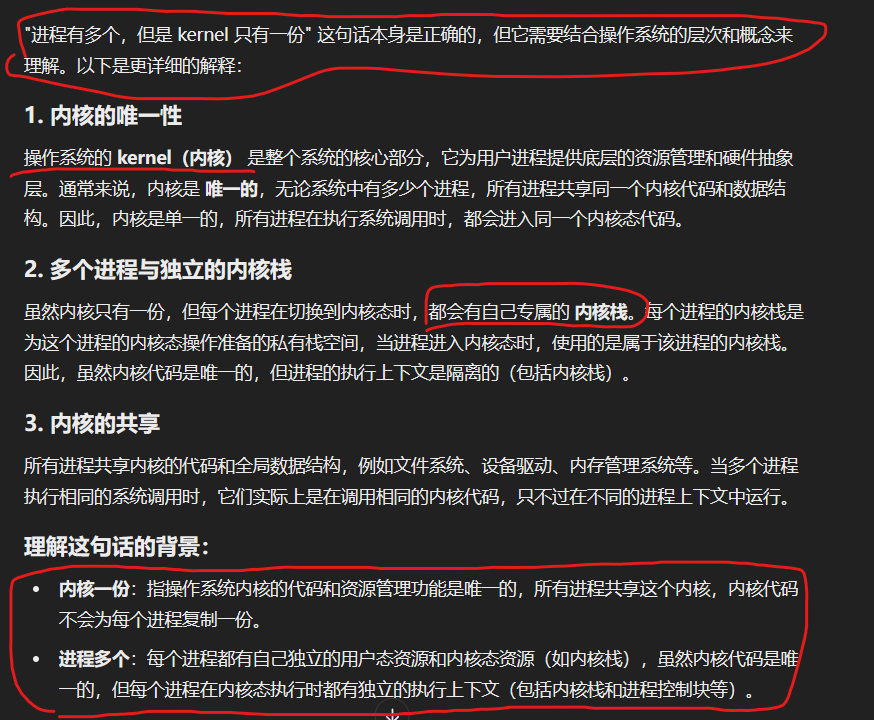

1、

就像线程：线程全局区、堆区共享。但是有时，人们又想 有独立的自己的空间：local_thread  关键字：堆上的数据  每个进程自己各自有一份独立的

2、walk 模拟硬件 MMU的功能：返回页表内容PTE 或写入页表内容

进行映射

3、qemu的 gdb调试：内部有一个 gdb输出端口，端口号 20666。。，然后 在写好 gdb 配置文件，remote localhost 连上端口即可

kernerl.asm  汇编文件

4、页表 Lab

将 kernel页表复制一份

copy_in copy_out

本来是要 通过地址（对用户地址进行翻译）翻译之后，才能 继续进行操作的

5、几个重要的寄存器

6、跳床 trappoline

uservc userret

7、ecall：
mode改为 supervisor 保存现在的程序计数器（SEPC）  PC设为 trap.c所在的地址位置  STVEC

8、懒分配 
我们先让 进程 sbrk调用成功，让进程 认为自己的 va已经有了对应的 pa；但是 实际上并没有，并且，下次它 执行 有关 va的操作时，产生 page fault，再对此 va进行 pa分配以及pagetable 进行映射

9、va后三位不为0，则va一定不是一个页表的起始地址，则 解除映射函数一定返回 false

10、

11、
ext3 多事务 日志处理方式

