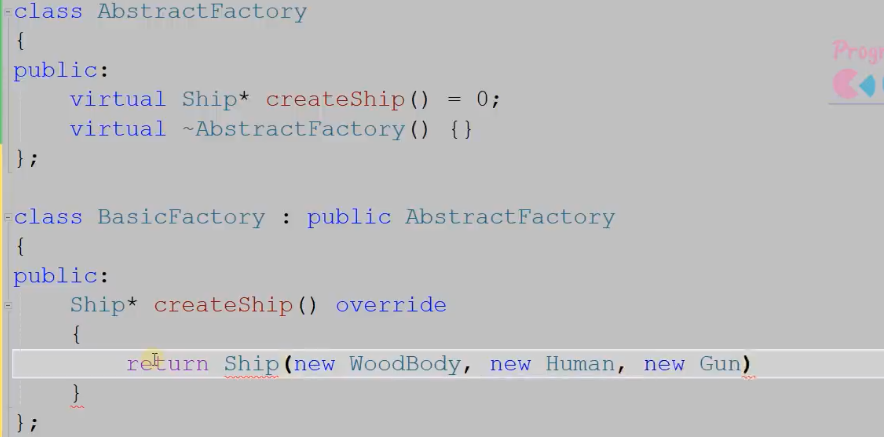

# 银行家算法
  Process : Max  Alloc need 
  System:  Avai

  for a process:
  Alloc+need <= Max && need <= Avai 

# LRU 
Listnode 里的 val：key+value;
Listnode*指针：pre+next

value 是为了 get获取结构;
key 是为了 m1中可以删除对应的节点 ：m1\<key,Listnode\>

# 排序
1、对于选择排序：选定一个 index，去找最合适的 value;
2、对于插入排序：选定一个 value，去找最合适的 index;
3、冒泡排序：没有选定什么，只是知道：如果进行 O(n^2)的复杂度的“两两相邻”交换排序后，数组就会有序。

# 不知道自己知道
设计模式很多都是来源于 现实生活的，就是很多的 为人处世的 方式！！

设计模式  “基于面向对象的语言” 

需要用到 ： 封装   继承  多态

面向对象  面向过程

对于大象装冰箱这件事：
如果 你是 按照，把每一步的过程：操作人 被操作者，及其做的每一步都写出来的话，那就是 **面向过程**
但是，如果你是按照：现在有  **大象**  **冰箱** 两个对象，然后 冰箱的可以干的事：打开 关闭;  大象：可以被操作，被移动。  那么你基于此去做：  冰箱.open();  大象.move() **大象自身的行为**;  冰箱.close();  那么就是 面向对象去进行编程了。(至于 如何实现 open  close  move，并且是  谁去实现的，那不用去过多关心) 

成员特征 成员行为
调用成员的 动作行为

**类：若干个相似或有联系的 行为和属性的抽象集合**

**类的实例：对象**

面向过程：会写一个 很泛很广，期望很无敌的函数，包含很多功能。
但是易冗余。容易出错。不易读。

而面向对象：函数的写法，是针对一个个对象的，较简洁；容易维护，可读性高，也不容易出错。

$\color{green}{封装：把一系列的 相似或有联系的 行为和属性的抽象放进一个集合中}$

继承：所谓私有的属性，无法继承是从使用的角度去说的，不是从 内存上去说的，不要抬杠！！(如果 真要按照 内存上去说的话，子类继承 父类，内存中 是有一个 “父类对象”的 子类.父类::func() 调用父类对象的 func函数)

多态：同名函数，具有不同的状态
 函数重写：**函数体执行逻辑不同，其它一样**  函数重载：其实，本质上是不同的函数，通过 **参数数量，参数类型 执行逻辑** 去进行重载

 子类中 函数后面加 override关键字，**表示 这是要重写父类的虚函数，需要在父类中找到 被重写函数的情况下，才不报错**
 

 但是注意，被此关键字修饰时，被重写的函数，要是父类的 虚函数或纯虚函数
 

当父类的函数是虚函数时，并且 子类重写了该虚函数，那么：
父类指针或引用，调用子类对象时，父类指针或引用去使用方法时，使用的是 子类重写的方法（若子类没重写，则使用的还是 父类内部的虚函数）

**含有纯虚函数：抽象类**

public protected private继承

继承的方式：
public：继承过来的东西的属性，按照在父类时的情况而定
private：继承过来后，全变成 private的属性，不可被外界访问
protected：继承过来后，属性都变成protected

**但是注意：父类的 private成员，对于子类和外界来说都是不可见的**

**而对于 父类中的protected来说，其对外部不可见，但对于子类来说是可见的，且继承过去之后，属性至少还是 protected**

在C++中，若两个数据类型不同的变量进行比较和计算时会 **先把数据类型统一之后，再做计算和比较**

**如果一个成员属于 类，则它被所有类对象共享，不被某个类对象，专属如：代码，static 变量** ，即使 类对象不存在，也不影响这些东西的存在 定义时即存在！

**Lambda表达式的大小，依据被捕捉的参数的大小而定，如捕捉2个 int参数，则该 Lambda参数的大小为8**

# 单一职责原则
类在初始设置时，尽量单一，这样有利于 后序的维护和扩展  
**类：一组相关属性和行为的抽象集合**（不要维护多组，关系很冗余的类，那样容易出BUG，且不好往后维护）

**写C++的时候，不要产生  万能类 万能函数的思想**

# 开放封闭原则
**对已经弄好的类，不修改，让别人做**  旧的类要预留接口！！！

如：父类 有某个虚函数，然后通过 继承 “动态多态”，让子类去实现该虚函数  再通过 **父类指针或引用 指向子类实际对象**，再调用实际的函数，实现对应的功能！！！ 

最后可以：**操作父类指针，但是 可以指向不同的子类对象，这样获得到的行为就是多样的！！**

开放：类中，已定义好的之外的空间
封闭：已定义好的方法和属性    **尽量不修改**

# 依赖倒转原则
抽象：设计模式中说的抽象，一般指 带有虚函数的类，但是不一定非得要求  纯虚函数  
虚函数可以相当于 一个类对外的接口！！

高层不要直接依赖低层，而是通过 中间的抽象层去访问低层  **抽象层有访问底层的接口，但具体的实现是低层去实现的**

这样可以保证：如果 低层依赖改变，那么对于 高层中的方法来说，没什么改动，**因为它调用 抽象的方法还是没变**，抽象也不用太大改动，**因为其方法就是一个 虚函数，具体实现，是低层自己做的！！**

# 里氏代换原则
**子类类型**可以完全替代**父类类型**
父类的所有方法细节都可以被子类给应用

# 单例模式 
在一个项目中，在全局范围内 对于某个类，**只有一个 实例的对象**，进行全局访问
C++中很少直接使用 全局变量  **没有被封装**，没有具体有限制的 **访问方法**，所以不太安全

**=default** 表明使用函数的默认行为；像：默认的构造函数的默认行为即是：什么都不做，只产生一个新对象

**=delete** 删除该函数的使用

静态的成员函数或成员变量 **属于这个类**，而不属于类对象

(https://www.runoob.com/w3cnote/cpp-static-const.html 类的 static const)

但是 实际上 const 常量可以声明时初始化，只不过，这样的话，所有对象的该常量值 不仅不可以修改，而且全都一样

**懒汉模式 饿汉模式**
饿汉：定义类的时候，就定义了 类对象
懒汉：什么时候使用类对象时，才创建对象
但是 饿汉模式下，有多线程危险：

Queue* Getinstance(){
  if(My_Task!=nullptr){
  My_Task=new Queue();
  return My_Task;
  }

  return My_Task;
}

如果多线程 同时，访问，同时看到 My_Task 为nullptr，那么会创建多个 My_Task 对象，违背了 单例对象的 **单一对象**的原则
（而 饿汉模式下，看到的  if判定永远为 假，所以永远不会再 调用 new Queue()了，也就不会再创建 新的对象）

加锁 效率会变低;但是 饿汉模式下，有内存浪费的嫌疑

此种改进方法，再多线程 第一次创建对象时，是同步顺序去加锁，解锁操作的，但是 后序再有多线程过来时，都是同步的，不用再加锁和解锁

c++11：如果指令逻辑进入一个未被初始化的声明变量，**则所有并发执行应当等待该变量完成初始化**！！！

而且：对于 静态变量，其是处于 全局数据区的，全局数据区的 默认数据初始值为 0，所以 当你给 全局数据区的数据 进行初始化赋值时，只要赋值是0，那么都会认为还没有被初始化！！
如 int a；没有被初始化   int a = 3；初始化；

static int a； static int a =0； 没有被初始化
static int a = 1； 被初始化

所以 懒汉模式下的单例可以这样写：

Example 中的 error：

使用递归锁：

# lambda表达式中的捕获

这里的捕获为何只能是 [&]  而不能用  [=]

**mutex 不支持复制** 复制出来一个副本，那 还是上 同一把锁吗？？ 那还能保证 访问的唯一性吗？  （**你的锁 都不是同一把，那么 多线程之间的 lock 和 unlock 就没有意义了**）

# 工厂模式
**首先 要明确：工厂类生产的是子类产品的对象，父类是一个抽象类，无法实例化对象**
**简单工厂**

工厂模式：生产工厂变成抽象，然后有具体的拥有不同生产功能的生产工厂

哪怕是后序有新的产品要生产，那么也不会破坏原来已经封装好的**生产工厂类**

工厂变成 抽象工厂父类，**生产时由具体的工厂对象进行生产**

**多态是设计模式的灵魂**

# 抽象工厂模式  对象更加复杂  （对象由组装而成，组装的各个部分又是有选择的，也是一种 抽象类）

最后生产的 **对象** 有一系列 小对象 **组合/聚合**  而成
（组合：一损俱损；聚合：分部合体）

**Ship** 对象 内部的 **动力** **船体** **武器** 三个部件，也是**抽象类**，可以按照需求再 具体类型

ship 产品抽象  （body engine weapon 也都是抽象类，其各自子类是 具体的类类型）

工厂抽象 不同工厂生产不同级别的ship

最后输出的 结果都是使用了 **多态**

# 1、创建型模式

# 2、结构性模式

# 3、行为模式
