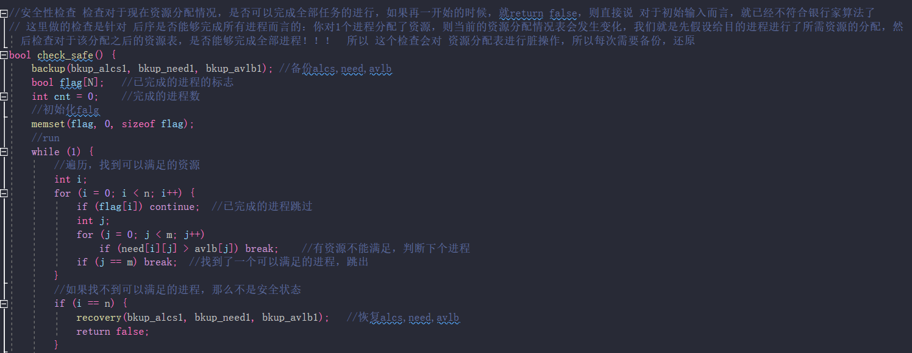

# 银行家算法的目的：要求程序运行时，根据不同的要求，给予是否分配资源的回答，如果可分配，输出安全序列；否则，给出输出拒绝理由
如：
**最大需求**  **已分配**  **当前需要**  **可用** 
核心思想是：持有数量+申请数量 一定<=最大需求&&<=现有可用的资源数量

**输出资源分配表**

**每一次的安全性检查，实际上是对 假设给某某进程分配资源后，全部进程是否可以全部完成，所以每次对 资源表都会进行脏操作，所以需要备份和还原**

**资源分配**

**main函数**

sleep睡5s，模拟分配资源之后，工作完成

修复备份做了两次：

Request：若进程分配资源后，检查错误，则恢复成：假设之前的资源表的情况
Check：对资源表进行大量的脏操作，执行进程，回收进程资源，然后不断循环，看是否能执行完全部进程，其实若：return false，则恢复的话，Request会进行恢复；但是，如果return true的话，因为 这里 Request没有做恢复，所以需要 恢复成： **假设分配之后，进来做安全性检查的资源分配表的情况**

看图：Request恢复的是 1 的资源分配表情况，此时未作任何假设处理       $\color{green}{假设失败之前的表}$
Check中恢复的是 2 的资源分配表情况，是假设给 **请求的进程** 分配了 **请求的资源**之后的 资源表的情况  $\color{green}{假设成功，做出修改之后的表}$

