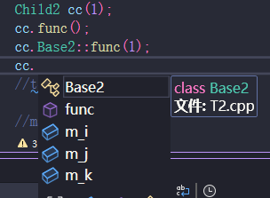
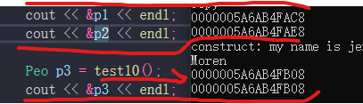

# 核心思想：谁申请的，谁释放；

##### 对于文件：谁打开的谁关闭

heap上的内存需要释放的原因：虽然 在程序结束之后，操作系统会把 heap释放掉，但是，这是对一些 小型的
程序而言可以的，因为 它的运行 可能消耗的 内存不是很多，但是：如果是 大型的服务器程序，那程序运行很长的
时间，这时 如果 你heap上数据 不清除 服务器一定会在某个时间上奔溃！

##### 我觉得程序员思想应该是：不能说 系统会帮我们做，我们就不做了！而是，如果我们可以做，我们就去做！！ 

# malloc alloc realloc

返回值 均是一个 void *va

    1. malloc (int)   int表示申请的内存的大小
    2. calloc (size_t nmemb, size_t size) 申请 nmemeb * size 大小的内存（size表示单位数据大小， nmemb表示要多少个此单位大小的内存）
    3. realloc (void* ptr, size_t size)  对 ptr重新分配内存（ptr 必须是 malloc或者calloc的返回值），如果，ptr起始的地址空间中，内存不足 size，则会重新找一片 内存空间，分配好 size内存，然后返回 新的ptr值
    
    1. free (void* ptr) 释放 **ptr** 空间

注意free之后， 按道理，p是不能够再去对之前对应的那片内存进行操作的，因为很有可能那片内存分给了别人！ **但是,由于p指针，本身是栈上的一个数据，其只有程序结束时，才会被释放，如果，你在 free之后，任然使用了p，那么编译器并不会报错，但十分危险，因为你很可能修改别人的内容（地址已分配给别人了）**

*p任然可以去修改那片地址里的内容，这很危险* 

